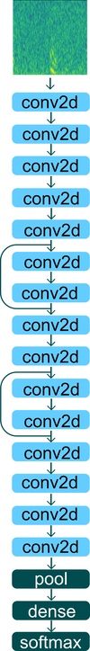
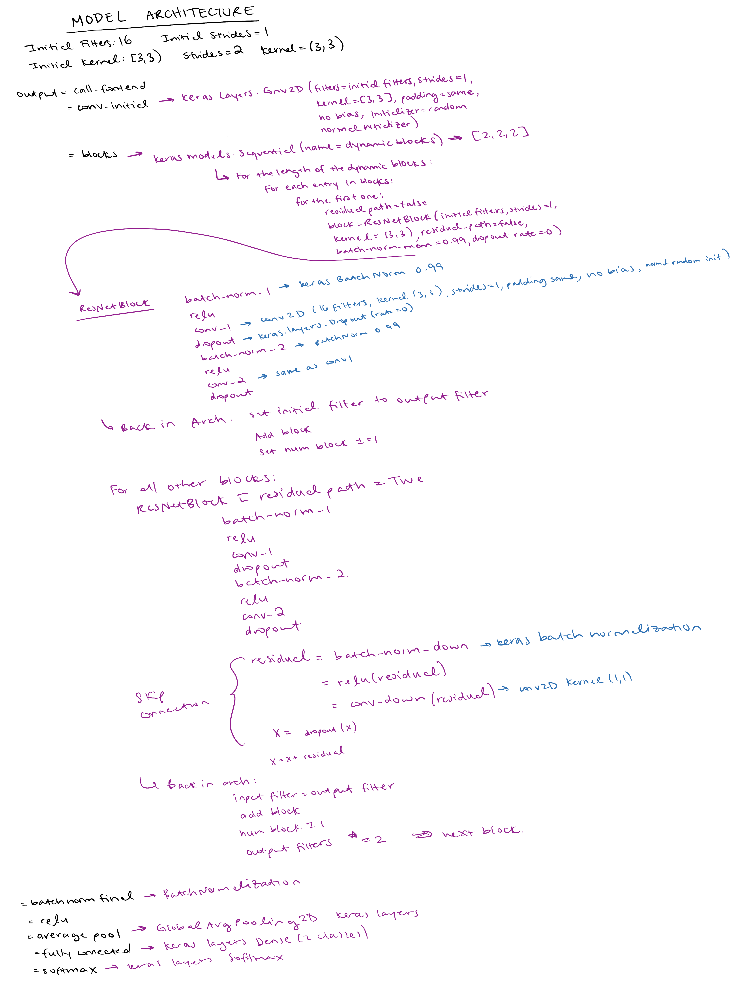
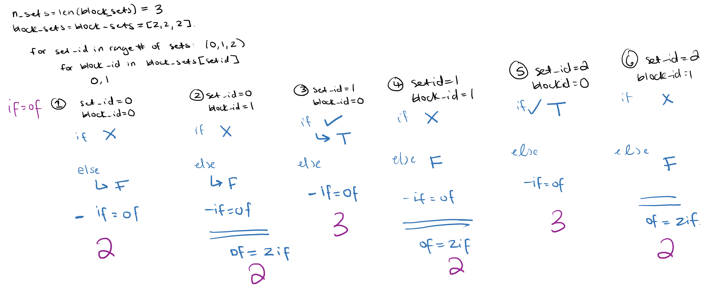

# Model

- Initial filters: 16
- Initial strides: 1
- Initial kernel: [3,3]
- Strides: 2
- Kernel: [3,3]
- No dropout (currently)
- Batch norm momentum: 0.99
- FScore loss
- train_X is a {16, 1500, 56, 1} array, which is batch size, time, freq, 1
- train_Y is a {16,2} array (labels like [1. 0.], [0. 1.])

