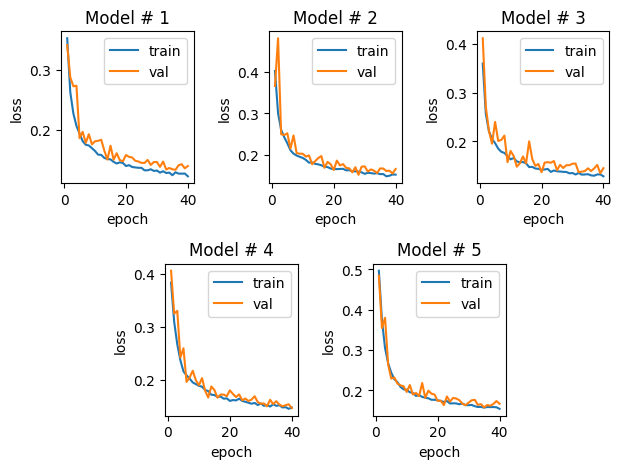
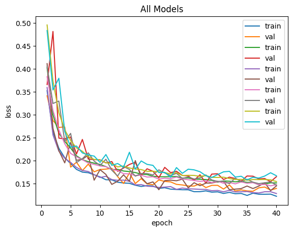
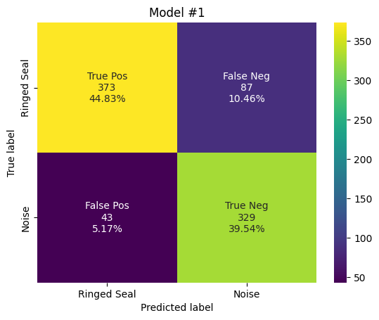
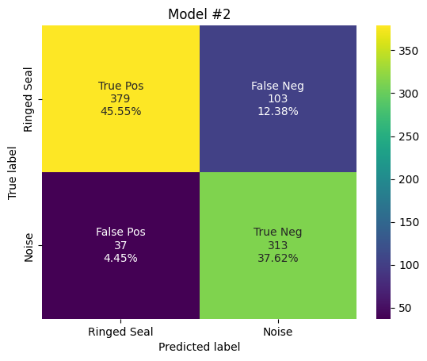
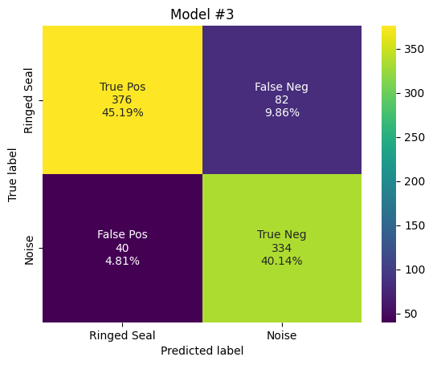

# Training 1s Ensemble

This notebook has the final code used to create the ringed seal detector. 

This uses: 
1. Run detector 5 times with different seeds on same datasets
2. Calc performance metrics for each model separately (like before ensemble) 
3. Get raw scores
4. Average raw scores
5. Set scores to N/A for spectrograms with inconsistent label predictions
6. Output raw detections file

Want to update this so before it computes TP, FP, etc, it uses the averaged scores instead of doing it for each, to come!

## Import Packages


```python
import pandas as pd
import numpy as np
import tensorflow as tf
import seaborn as sns
import shutil
import os 
import csv
import matplotlib.pyplot as plt
from sklearn.metrics import confusion_matrix as confusion_matrix_sklearn

from ketos.data_handling import selection_table as sl
import ketos.data_handling.database_interface as dbi
from ketos.data_handling.parsing import load_audio_representation
from ketos.data_handling.data_feeding import BatchGenerator
from ketos.neural_networks.resnet import ResNetInterface
from ketos.audio.audio_loader import AudioFrameLoader, AudioLoader, SelectionTableIterator
from ketos.audio.spectrogram import MagSpectrogram
from ketos.neural_networks.dev_utils.detection import batch_load_audio_file_data, filter_by_threshold
from ketos.data_handling.data_feeding import JointBatchGen

import warnings
warnings.simplefilter(action='ignore', category=FutureWarning)

print('done importing packages')
```

    C:\Users\kzammit\Miniconda3\envs\ketos_env\lib\site-packages\keras\optimizer_v2\adam.py:105: UserWarning: The `lr` argument is deprecated, use `learning_rate` instead.
      super(Adam, self).__init__(name, **kwargs)
    

    done importing packages
    

## User Inputs


```python
# Load in user inputs 
main_folder = r'C:\Users\kzammit\Documents\Detector\detector-1sec'

# These are copied from the 2sec edited folder 
neg_folder = main_folder + '\\' + r'inputs\annotations\negatives'
pos_folder = main_folder + '\\' + r'inputs\annotations\positives'

spec_file = main_folder + '\\' + r'inputs\spec_config_1sec.json'

data_folder = r'D:\ringed-seal-data'
db_name = main_folder + '\\' r'manual_database_1sec.h5'
recipe = main_folder + '\\' + r'inputs\resnet_recipe.json'
output_name = main_folder + '\\' + 'rs-1sec.kt'

# Define the split for the training, validation, and test datasets from each site 
ulu_vals = [634, 179, 88]
ulu2022_vals = [949, 274, 139]
kk_vals = [1230, 348, 171]
cb_vals = [130, 37, 18]
```

## Step One: Create Database 

A database consisting of manually verified spectrogram segments is created using excel workbooks.


```python
## Create Database ##

# negatives tables and standarize for ketos
ulu_neg = pd.read_excel(neg_folder + '\\' + 'std_ULU_negatives-manual-FINAL.xlsx')
ulu_neg = ulu_neg.ffill()
ulu_neg = sl.standardize(table=ulu_neg)
print('Negatives standardized? ' + str(sl.is_standardized(ulu_neg)))

ulu2022_neg = pd.read_excel(neg_folder + '\\' + 'std_ULU2022_negatives-manual-FINAL.xlsx')
ulu2022_neg = ulu2022_neg.ffill()
ulu2022_neg = sl.standardize(table=ulu2022_neg)
print('Negatives standardized? ' + str(sl.is_standardized(ulu2022_neg)))

kk_neg = pd.read_excel(neg_folder + '\\' + 'std_KK_negatives-manual-FINAL.xlsx')
kk_neg = kk_neg.ffill()
kk_neg = sl.standardize(table=kk_neg)
print('Negatives standardized? ' + str(sl.is_standardized(kk_neg)))

cb_neg = pd.read_excel(neg_folder + '\\' + 'std_CB_negatives-manual-FINAL.xlsx')
cb_neg = cb_neg.ffill()
cb_neg = sl.standardize(table=cb_neg)
print('Negatives standardized? ' + str(sl.is_standardized(cb_neg)))

# positives tables
ulu_pos = pd.read_excel(pos_folder + '\\' + 'std_ULU_positives.xlsx')
ulu_pos = ulu_pos.ffill()
ulu_pos = sl.standardize(table=ulu_pos, start_labels_at_1=True)
print('Positives standardized? ' + str(sl.is_standardized(ulu_pos)))

ulu2022_pos = pd.read_excel(pos_folder + '\\' + 'std_ULU2022_positives.xlsx')
ulu2022_pos = ulu2022_pos.ffill()
ulu2022_pos = sl.standardize(table=ulu2022_pos, start_labels_at_1=True)
print('Positives standardized? ' + str(sl.is_standardized(ulu2022_pos)))

kk_pos = pd.read_excel(pos_folder + '\\' + 'std_KK_positives.xlsx')
kk_pos = kk_pos.ffill()
kk_pos = sl.standardize(table=kk_pos, start_labels_at_1=True)
print('Positives standardized? ' + str(sl.is_standardized(kk_pos)))

cb_pos = pd.read_excel(pos_folder + '\\' + 'std_CB_positives.xlsx')
cb_pos = cb_pos.ffill()
cb_pos = sl.standardize(table=cb_pos, start_labels_at_1=True)
print('Positives standardized? ' + str(sl.is_standardized(cb_pos)))

# join into complete tables

ulu_pos_tr = ulu_pos.head(ulu_vals[0])
ulu_pos_va = ulu_pos[ulu_vals[0]:ulu_vals[0] + ulu_vals[1]]
ulu_pos_te = ulu_pos.tail(ulu_vals[2])

ulu_neg_tr = ulu_neg.head(ulu_vals[0])
ulu_neg_va = ulu_neg[ulu_vals[0]:ulu_vals[0] + ulu_vals[1]]
ulu_neg_te = ulu_neg.tail(ulu_vals[2])

ulu_tr = pd.concat([ulu_pos_tr, ulu_neg_tr])
ulu_va = pd.concat([ulu_pos_va, ulu_neg_va])
ulu_te = pd.concat([ulu_pos_te, ulu_neg_te])

ulu2022_pos_tr = ulu2022_pos.head(ulu2022_vals[0])
ulu2022_pos_va = ulu2022_pos[ulu2022_vals[0]:ulu2022_vals[0] + ulu2022_vals[1]]
ulu2022_pos_te = ulu2022_pos.tail(ulu2022_vals[2])

ulu2022_neg_tr = ulu2022_neg.head(ulu2022_vals[0])
ulu2022_neg_va = ulu2022_neg[ulu2022_vals[0]:ulu2022_vals[0] + ulu2022_vals[1]]
ulu2022_neg_te = ulu2022_neg.tail(ulu2022_vals[2])

ulu2022_tr = pd.concat([ulu2022_pos_tr, ulu2022_neg_tr])
ulu2022_va = pd.concat([ulu2022_pos_va, ulu2022_neg_va])
ulu2022_te = pd.concat([ulu2022_pos_te, ulu2022_neg_te])

kk_pos_tr = kk_pos.head(kk_vals[0])
kk_pos_va = kk_pos[kk_vals[0]:kk_vals[0] + kk_vals[1]]
kk_pos_te = kk_pos.tail(kk_vals[2])

kk_neg_tr = kk_neg.head(kk_vals[0])
kk_neg_va = kk_neg[kk_vals[0]:kk_vals[0] + kk_vals[1]]
kk_neg_te = kk_neg.tail(kk_vals[2])

kk_tr = pd.concat([kk_pos_tr, kk_neg_tr])
kk_va = pd.concat([kk_pos_va, kk_neg_va])
kk_te = pd.concat([kk_pos_te, kk_neg_te])

cb_pos_tr = cb_pos.head(cb_vals[0])
cb_pos_va = cb_pos[cb_vals[0]:cb_vals[0] + cb_vals[1]]
cb_pos_te = cb_pos.tail(cb_vals[2])

cb_neg_tr = cb_neg.head(cb_vals[0])
cb_neg_va = cb_neg[cb_vals[0]:cb_vals[0] + cb_vals[1]]
cb_neg_te = cb_neg.tail(cb_vals[2])

cb_tr = pd.concat([cb_pos_tr, cb_neg_tr])
cb_va = pd.concat([cb_pos_va, cb_neg_va])
cb_te = pd.concat([cb_pos_te, cb_neg_te])

# final three tables

train = pd.concat([ulu_tr, ulu2022_tr, cb_tr, kk_tr])
val = pd.concat([ulu_va, ulu2022_va, cb_va, kk_va])
test = pd.concat([ulu_te, ulu2022_te, cb_te, kk_te])
```

    Negatives standardized? True
    Negatives standardized? True
    Negatives standardized? True
    Negatives standardized? True
    Positives standardized? True
    Positives standardized? True
    Positives standardized? True
    Positives standardized? True
    


```python
# edit to be 1s duration by adding 0.5 to the start time, and subtracting 0.5 from the end time 
train['start'] += 0.5
train['end'] -= 0.5

val['start'] += 0.5
val['end'] -= 0.5

test['start'] +=0.5
test['end'] -= 0.5
```


```python
# join into a database

# Load the spectrogram representation & parameters, this returns a dict 
spec_cfg = load_audio_representation(spec_file, name="spectrogram")

# Create a table called "train" in the database, defined by db_name, using the "train" selections table, the spectrogram config, and the audio data 
# Behind the hood, this creates an AudioLoader and AudioWriter Ketos function which generates the spectrograms for each selection 
# For the specific spectrogram in this case, the spectrograms are of size [1500,56] where 56 refers to the frequency dimension and 1500 refers to the time dimension 
# The size of the spectrogram is 1500*56, which is 84000
dbi.create_database(output_file=db_name,  # empty brackets
                    dataset_name=r'train', selections=train, data_dir=data_folder,
                    audio_repres=spec_cfg)

dbi.create_database(output_file=db_name,  # empty brackets
                    dataset_name=r'val', selections=val, data_dir=data_folder,
                    audio_repres=spec_cfg)

dbi.create_database(output_file=db_name,  # empty brackets
                    dataset_name=r'test', selections=test, data_dir=data_folder,
                    audio_repres=spec_cfg)
```

    100%|██████████████████████████████████████████████████████████████████████████████| 5886/5886 [02:43<00:00, 36.09it/s]
    

    5886 items saved to C:\Users\kzammit\Documents\Detector\detector-1sec\manual_database_1sec.h5
    

    100%|██████████████████████████████████████████████████████████████████████████████| 1676/1676 [00:40<00:00, 40.92it/s]
    

    1676 items saved to C:\Users\kzammit\Documents\Detector\detector-1sec\manual_database_1sec.h5
    

    100%|████████████████████████████████████████████████████████████████████████████████| 832/832 [00:20<00:00, 40.93it/s]

    832 items saved to C:\Users\kzammit\Documents\Detector\detector-1sec\manual_database_1sec.h5
    

    
    


```python
# Save the final excel sheets for future reference 
train.to_excel(main_folder + '\\' + 'sel_train.xlsx')
val.to_excel(main_folder + '\\' + 'sel_val.xlsx')
test.to_excel(main_folder + '\\' + 'sel_test.xlsx')
```

## Step Two: Train Classifier


```python
# Set the random seed for numpy and tensorflow 

np_seeds = [1000, 2000, 3000, 4000, 5000]

tf_seeds = [2000, 3000, 4000, 5000, 6000]

output_names = [main_folder + '\\' + 'rs-1sec-1.kt', main_folder + '\\' + 'rs-1sec-2.kt', main_folder + '\\' + 'rs-1sec-3.kt', main_folder + '\\' + 'rs-1sec-4.kt', 
                main_folder + '\\' + 'rs-1sec-5.kt']

checkpoint_folders = [main_folder + '\\' + 'checkpoints-1', main_folder + '\\' + 'checkpoints-2', main_folder + '\\' + 'checkpoints-3', main_folder + '\\' + 'checkpoints-4', 
                      main_folder + '\\' + 'checkpoints-5']

log_folders = [main_folder + '\\' + 'logs-1', main_folder + '\\' + 'logs-2', main_folder + '\\' + 'logs-3', main_folder + '\\' + 'logs-4', main_folder + '\\' + 'logs-5']

# Set the batch size and number of epochs for training
batch_size = 16
n_epochs = 40
    
for idx, name in enumerate(output_names):

    np.random.seed(np_seeds[idx])
    tf.random.set_seed(tf_seeds[idx])
    
    # Set the log folder and checkpoint folder 
    log_folder = log_folders[idx]
    checkpoint_folder = checkpoint_folders[idx]
    
    # Open the database file in read mode
    db = dbi.open_file(db_name, 'r')
    
    # Open the training and validation tables respectively 
    train_data = dbi.open_table(db, "/train/data")
    val_data = dbi.open_table(db, "/val/data")
    
    # Create batches of training data of size batch size, using the specified data table 
    # This returns indices of the data in each batch along with their labels 
    train_generator = BatchGenerator(batch_size=batch_size, data_table=train_data,
                                        output_transform_func=ResNetInterface.transform_batch,
                                        shuffle=True, refresh_on_epoch_end=True)
    
    # Create batches of validation data of size batch size, using the specified data table 
    # This returns indices of the data in each batch along with their labels 
    val_generator = BatchGenerator(batch_size=batch_size, data_table=val_data,
                                       output_transform_func=ResNetInterface.transform_batch,
                                       shuffle=False, refresh_on_epoch_end=False)
    
    # Build the ResNet model file based off of the recipe file - this creates a "ResNetInterface" object 
    resnet = ResNetInterface.build(recipe)
    
    # Set the training and validation generators to the batch generators created above 
    resnet.train_generator = train_generator
    resnet.val_generator = val_generator
    
    # Set the model log and checkpoint directory 
    resnet.log_dir = log_folder
    resnet.checkpoint_dir = checkpoint_folder
    
    # Train the model, looping through all of the training and validation data 
    # See code map for more information
    resnet.train_loop(n_epochs=n_epochs, verbose=False, log_csv=True, csv_name='log.csv')
    
    # Close the database 
    db.close()
    
    # Save the model file, and keep track of the spectrogram parameters used to generate that model 
    resnet.save(output_names[idx], audio_repr_file=spec_file)

    print('done training model # ' + str(idx))

print('done')
```

    done training model # 0
    done training model # 1
    done training model # 2
    done training model # 3
    done training model # 4
    done
    

### Plots 


```python
ax1 = plt.subplot2grid(shape=(2,6), loc=(0,0), colspan=2)
ax2 = plt.subplot2grid((2,6), (0,2), colspan=2)
ax3 = plt.subplot2grid((2,6), (0,4), colspan=2)
ax4 = plt.subplot2grid((2,6), (1,1), colspan=2)
ax5 = plt.subplot2grid((2,6), (1,3), colspan=2)

axes = [ax1, ax2, ax3, ax4, ax5]

for idx, folder in enumerate(log_folders): 
    
    # Read the log file 
    log_file = pd.read_csv(folder + '\\' + 'log.csv')
    
    # Get the training and validation losses 
    tr_results = log_file[log_file['dataset']=='train']
    va_results = log_file[log_file['dataset']=='val']
    
    sns.lineplot(ax=axes[idx], data=tr_results, x='epoch', y='loss', label='train', legend='auto').set(title='Model # ' + str(idx+1))
    sns.lineplot(ax=axes[idx], data=va_results, x='epoch', y='loss', label='val', legend='auto').set(title='Model # ' + str(idx+1))   

plt.tight_layout()
```


    

    


```python
for idx, folder in enumerate(log_folders): 
    
    # Read the log file 
    log_file = pd.read_csv(folder + '\\' + 'log.csv')
    
    # Get the training and validation losses 
    tr_results = log_file[log_file['dataset']=='train']
    va_results = log_file[log_file['dataset']=='val']
    
    sns.lineplot(data=tr_results, x='epoch', y='loss', label='train', legend='auto').set(title='All Models')
    sns.lineplot(data=va_results, x='epoch', y='loss', label='val', legend='auto').set(title='All Models')  
```


    

    


## Step Three: Deploy Detector

### Copy Testing Files to Audio Folder


```python
import shutil

# Necessary for other steps 
test_filled = test.reset_index(allow_duplicates=True)

# Set pathway to audio folder 
audio_folder = main_folder + '\\' + 'audio'

# Copy files from main data folder into audio folder if they match the testing dataframe files 
for idex, row in test_filled.iterrows():
    shutil.copyfile(test_filled.loc[idex]['filename'], audio_folder + '\\' + test_filled.loc[idex]['filename'].split('\\')[-1])

print('done')
```

    done
    

### Deploy Detector on Audio Data


```python
# Set the temp folder, detections csv, detections threshold, step size, batch size, and buffer 
temp_folder = [main_folder + '\\' + 'ringedS_tmp_folder-1', main_folder + '\\' + 'ringedS_tmp_folder-2', main_folder + '\\' + 'ringedS_tmp_folder-3', 
               main_folder + '\\' + 'ringedS_tmp_folder-4', main_folder + '\\' + 'ringedS_tmp_folder-5']

detections_csv = [main_folder + '\\' + 'detections_raw-1.csv', main_folder + '\\' + 'detections_raw-2.csv', main_folder + '\\' + 'detections_raw-3.csv', 
                  main_folder + '\\' + 'detections_raw-4.csv', main_folder + '\\' + 'detections_raw-5.csv']

threshold = 0.5
step_size = 1.0
batch_size = 16
buffer = 0.5 
```


```python
# Load the already trained model file 

for idx, model in enumerate(output_names):

    model = ResNetInterface.load(model_file=output_names[idx], new_model_folder=temp_folder[idx])

    print('Now deploying model # ' + str(idx+1))
    
    # Load the audio representation (dict)
    audio_repr = load_audio_representation(path=spec_file)
    
    # Get the config from the "spectrogram" audio representation
    # This is helpful if I had "waveform" as well in the representation options as well 
    spec_config = audio_repr['spectrogram']
    
    # Create an audioFrameLoader containing the spectrogram parameters and type 
    audio_loader = AudioFrameLoader(path=audio_folder, duration=spec_config['duration'],
                                        step=step_size, stop=False, representation=spec_config['type'],
                                        representation_params=spec_config, pad=False)
    
    # Initialize a detections dataframe 
    detections = pd.DataFrame()
    
    # Load the audio data in the defined batch size with the audio loader object 
    batch_generator = batch_load_audio_file_data(loader=audio_loader, batch_size=batch_size)
    
    # for each batch
    for batch_data in batch_generator:
        
        # Run the model on the spectrogram data from the current batch
        batch_predictions = model.run_on_batch(batch_data['data'], return_raw_output=True)
    
        # Lets store our data in a dictionary
        raw_output = {'filename': batch_data['filename'], 'start': batch_data['start'], 'end': batch_data['end'],
                      'score': batch_predictions}
    
        # Filter the raw detections by the threshold, dropping detections below the threshold 
        # will be a dataframe with the filename, start, end, label, and score 
        batch_detections = filter_by_threshold(raw_output, threshold=threshold)
    
        # Add these detections to the detections dataframe 
        detections = pd.concat([detections, batch_detections], ignore_index=True)
    
    # Output the detections that were over a threshold to a csv file
    detections.to_csv(detections_csv[idx], index=False)
```

    Now deploying model # 1
    

      0%|                                                                                         | 0/3856 [00:00<?, ?it/s]RuntimeWarning: Waveform padded with its own reflection to achieve required length to compute the stft. 73 samples were padded on the left and 0 samples were padded on the right
      5%|███▊                                                                           | 185/3856 [00:15<05:10, 11.83it/s]RuntimeWarning: Waveform padded with its own reflection to achieve required length to compute the stft. 0 samples were padded on the left and 77 samples were padded on the right
     46%|███████████████████████████████████▌                                          | 1756/3856 [02:43<03:21, 10.43it/s]RuntimeWarning: Waveform padded with its own reflection to achieve required length to compute the stft. 0 samples were padded on the left and 76 samples were padded on the right
     46%|███████████████████████████████████▉                                          | 1774/3856 [02:45<03:09, 10.97it/s]RuntimeWarning: Waveform padded with its own reflection to achieve required length to compute the stft. 0 samples were padded on the left and 54 samples were padded on the right
     47%|████████████████████████████████████▎                                         | 1794/3856 [02:46<03:17, 10.44it/s]RuntimeWarning: Waveform padded with its own reflection to achieve required length to compute the stft. 0 samples were padded on the left and 19 samples were padded on the right
     50%|██████████████████████████████████████▉                                       | 1925/3856 [02:59<03:05, 10.41it/s]RuntimeWarning: Waveform padded with its own reflection to achieve required length to compute the stft. 0 samples were padded on the left and 59 samples were padded on the right
     51%|███████████████████████████████████████▋                                      | 1963/3856 [03:03<02:52, 10.98it/s]RuntimeWarning: Waveform padded with its own reflection to achieve required length to compute the stft. 0 samples were padded on the left and 74 samples were padded on the right
     53%|█████████████████████████████████████████▏                                    | 2037/3856 [03:09<02:44, 11.06it/s]RuntimeWarning: Waveform padded with its own reflection to achieve required length to compute the stft. 0 samples were padded on the left and 66 samples were padded on the right
     55%|██████████████████████████████████████████▋                                   | 2113/3856 [03:17<02:16, 12.74it/s]RuntimeWarning: Waveform padded with its own reflection to achieve required length to compute the stft. 0 samples were padded on the left and 52 samples were padded on the right
     57%|████████████████████████████████████████████▌                                 | 2205/3856 [03:26<02:42, 10.16it/s]RuntimeWarning: Waveform padded with its own reflection to achieve required length to compute the stft. 0 samples were padded on the left and 50 samples were padded on the right
     60%|██████████████████████████████████████████████▌                               | 2299/3856 [03:35<02:41,  9.64it/s]RuntimeWarning: Waveform padded with its own reflection to achieve required length to compute the stft. 0 samples were padded on the left and 21 samples were padded on the right
     61%|███████████████████████████████████████████████▋                              | 2356/3856 [03:41<02:52,  8.71it/s]RuntimeWarning: Waveform padded with its own reflection to achieve required length to compute the stft. 0 samples were padded on the left and 51 samples were padded on the right
     62%|████████████████████████████████████████████████                              | 2374/3856 [03:43<02:49,  8.73it/s]RuntimeWarning: Waveform padded with its own reflection to achieve required length to compute the stft. 0 samples were padded on the left and 62 samples were padded on the right
     64%|█████████████████████████████████████████████████▉                            | 2468/3856 [03:51<02:12, 10.50it/s]RuntimeWarning: Waveform padded with its own reflection to achieve required length to compute the stft. 0 samples were padded on the left and 23 samples were padded on the right
     64%|██████████████████████████████████████████████████▎                           | 2487/3856 [03:53<02:17,  9.97it/s]RuntimeWarning: Waveform padded with its own reflection to achieve required length to compute the stft. 0 samples were padded on the left and 58 samples were padded on the right
     68%|████████████████████████████████████████████████████▉                         | 2619/3856 [04:06<02:03, 10.02it/s]RuntimeWarning: Waveform padded with its own reflection to achieve required length to compute the stft. 0 samples were padded on the left and 61 samples were padded on the right
     69%|██████████████████████████████████████████████████████                        | 2674/3856 [04:11<01:55, 10.25it/s]RuntimeWarning: Waveform padded with its own reflection to achieve required length to compute the stft. 0 samples were padded on the left and 55 samples were padded on the right
     70%|██████████████████████████████████████████████████████▍                       | 2694/3856 [04:13<01:55, 10.03it/s]RuntimeWarning: Waveform padded with its own reflection to achieve required length to compute the stft. 0 samples were padded on the left and 4 samples were padded on the right
     72%|███████████████████████████████████████████████████████▉                      | 2768/3856 [04:21<01:51,  9.76it/s]RuntimeWarning: Waveform padded with its own reflection to achieve required length to compute the stft. 0 samples were padded on the left and 15 samples were padded on the right
     75%|██████████████████████████████████████████████████████████▋                   | 2900/3856 [04:33<01:20, 11.85it/s]RuntimeWarning: Waveform padded with its own reflection to achieve required length to compute the stft. 0 samples were padded on the left and 40 samples were padded on the right
     77%|███████████████████████████████████████████████████████████▊                  | 2956/3856 [04:39<01:27, 10.26it/s]RuntimeWarning: Waveform padded with its own reflection to achieve required length to compute the stft. 0 samples were padded on the left and 11 samples were padded on the right
     78%|████████████████████████████████████████████████████████████▌                 | 2993/3856 [04:43<01:44,  8.29it/s]RuntimeWarning: Waveform padded with its own reflection to achieve required length to compute the stft. 0 samples were padded on the left and 43 samples were padded on the right
     80%|██████████████████████████████████████████████████████████████                | 3067/3856 [04:50<01:07, 11.61it/s]RuntimeWarning: Waveform padded with its own reflection to achieve required length to compute the stft. 0 samples were padded on the left and 29 samples were padded on the right
     83%|████████████████████████████████████████████████████████████████▋             | 3199/3856 [05:03<01:16,  8.56it/s]RuntimeWarning: Waveform padded with its own reflection to achieve required length to compute the stft. 0 samples were padded on the left and 10 samples were padded on the right
     85%|██████████████████████████████████████████████████████████████████▌           | 3292/3856 [05:11<00:53, 10.49it/s]RuntimeWarning: Waveform padded with its own reflection to achieve required length to compute the stft. 0 samples were padded on the left and 69 samples were padded on the right
     86%|███████████████████████████████████████████████████████████████████▍          | 3331/3856 [05:15<00:52,  9.91it/s]RuntimeWarning: Waveform padded with its own reflection to achieve required length to compute the stft. 0 samples were padded on the left and 56 samples were padded on the right
     92%|███████████████████████████████████████████████████████████████████████▌      | 3536/3856 [05:35<00:31, 10.24it/s]RuntimeWarning: Waveform padded with its own reflection to achieve required length to compute the stft. 0 samples were padded on the left and 70 samples were padded on the right
     92%|███████████████████████████████████████████████████████████████████████▉      | 3554/3856 [05:36<00:29, 10.38it/s]RuntimeWarning: Waveform padded with its own reflection to achieve required length to compute the stft. 0 samples were padded on the left and 38 samples were padded on the right
     94%|█████████████████████████████████████████████████████████████████████████▍    | 3630/3856 [05:44<00:21, 10.41it/s]RuntimeWarning: Waveform padded with its own reflection to achieve required length to compute the stft. 0 samples were padded on the left and 1 samples were padded on the right
     95%|█████████████████████████████████████████████████████████████████████████▊    | 3649/3856 [05:46<00:20, 10.18it/s]RuntimeWarning: Waveform padded with its own reflection to achieve required length to compute the stft. 0 samples were padded on the left and 7 samples were padded on the right
     99%|█████████████████████████████████████████████████████████████████████████████▏| 3817/3856 [06:02<00:03,  9.84it/s]RuntimeWarning: Waveform padded with its own reflection to achieve required length to compute the stft. 0 samples were padded on the left and 65 samples were padded on the right
    100%|██████████████████████████████████████████████████████████████████████████████| 3856/3856 [06:07<00:00, 10.49it/s]
    

    Now deploying model # 2
    

      0%|                                                                                         | 0/3856 [00:00<?, ?it/s]RuntimeWarning: Waveform padded with its own reflection to achieve required length to compute the stft. 73 samples were padded on the left and 0 samples were padded on the right
      5%|███▊                                                                           | 185/3856 [00:14<05:18, 11.51it/s]RuntimeWarning: Waveform padded with its own reflection to achieve required length to compute the stft. 0 samples were padded on the left and 77 samples were padded on the right
     46%|███████████████████████████████████▌                                          | 1757/3856 [02:44<03:25, 10.21it/s]RuntimeWarning: Waveform padded with its own reflection to achieve required length to compute the stft. 0 samples were padded on the left and 76 samples were padded on the right
     46%|███████████████████████████████████▉                                          | 1775/3856 [02:46<03:20, 10.37it/s]RuntimeWarning: Waveform padded with its own reflection to achieve required length to compute the stft. 0 samples were padded on the left and 54 samples were padded on the right
     46%|████████████████████████████████████▎                                         | 1793/3856 [02:47<03:27,  9.94it/s]RuntimeWarning: Waveform padded with its own reflection to achieve required length to compute the stft. 0 samples were padded on the left and 19 samples were padded on the right
     50%|██████████████████████████████████████▉                                       | 1924/3856 [03:00<02:46, 11.61it/s]RuntimeWarning: Waveform padded with its own reflection to achieve required length to compute the stft. 0 samples were padded on the left and 59 samples were padded on the right
     51%|███████████████████████████████████████▋                                      | 1962/3856 [03:03<03:08, 10.04it/s]RuntimeWarning: Waveform padded with its own reflection to achieve required length to compute the stft. 0 samples were padded on the left and 74 samples were padded on the right
     53%|█████████████████████████████████████████▏                                    | 2037/3856 [03:11<02:19, 13.06it/s]RuntimeWarning: Waveform padded with its own reflection to achieve required length to compute the stft. 0 samples were padded on the left and 66 samples were padded on the right
     55%|██████████████████████████████████████████▋                                   | 2113/3856 [03:18<02:44, 10.58it/s]RuntimeWarning: Waveform padded with its own reflection to achieve required length to compute the stft. 0 samples were padded on the left and 52 samples were padded on the right
     57%|████████████████████████████████████████████▌                                 | 2205/3856 [03:27<02:43, 10.12it/s]RuntimeWarning: Waveform padded with its own reflection to achieve required length to compute the stft. 0 samples were padded on the left and 50 samples were padded on the right
     60%|██████████████████████████████████████████████▌                               | 2299/3856 [03:37<01:56, 13.34it/s]RuntimeWarning: Waveform padded with its own reflection to achieve required length to compute the stft. 0 samples were padded on the left and 21 samples were padded on the right
     61%|███████████████████████████████████████████████▋                              | 2355/3856 [03:41<02:16, 11.03it/s]RuntimeWarning: Waveform padded with its own reflection to achieve required length to compute the stft. 0 samples were padded on the left and 51 samples were padded on the right
     62%|████████████████████████████████████████████████                              | 2375/3856 [03:43<02:22, 10.42it/s]RuntimeWarning: Waveform padded with its own reflection to achieve required length to compute the stft. 0 samples were padded on the left and 62 samples were padded on the right
     64%|█████████████████████████████████████████████████▉                            | 2469/3856 [03:53<02:47,  8.27it/s]RuntimeWarning: Waveform padded with its own reflection to achieve required length to compute the stft. 0 samples were padded on the left and 23 samples were padded on the right
     64%|██████████████████████████████████████████████████▎                           | 2486/3856 [03:54<01:51, 12.34it/s]RuntimeWarning: Waveform padded with its own reflection to achieve required length to compute the stft. 0 samples were padded on the left and 58 samples were padded on the right
     68%|████████████████████████████████████████████████████▉                         | 2618/3856 [04:07<02:02, 10.15it/s]RuntimeWarning: Waveform padded with its own reflection to achieve required length to compute the stft. 0 samples were padded on the left and 61 samples were padded on the right
     69%|██████████████████████████████████████████████████████                        | 2674/3856 [04:12<01:57, 10.04it/s]RuntimeWarning: Waveform padded with its own reflection to achieve required length to compute the stft. 0 samples were padded on the left and 55 samples were padded on the right
     70%|██████████████████████████████████████████████████████▍                       | 2693/3856 [04:14<01:51, 10.44it/s]RuntimeWarning: Waveform padded with its own reflection to achieve required length to compute the stft. 0 samples were padded on the left and 4 samples were padded on the right
     72%|████████████████████████████████████████████████████████                      | 2769/3856 [04:22<02:10,  8.30it/s]RuntimeWarning: Waveform padded with its own reflection to achieve required length to compute the stft. 0 samples were padded on the left and 15 samples were padded on the right
     75%|██████████████████████████████████████████████████████████▋                   | 2900/3856 [04:34<01:29, 10.74it/s]RuntimeWarning: Waveform padded with its own reflection to achieve required length to compute the stft. 0 samples were padded on the left and 40 samples were padded on the right
     77%|███████████████████████████████████████████████████████████▊                  | 2956/3856 [04:39<01:26, 10.46it/s]RuntimeWarning: Waveform padded with its own reflection to achieve required length to compute the stft. 0 samples were padded on the left and 11 samples were padded on the right
     78%|████████████████████████████████████████████████████████████▌                 | 2992/3856 [04:42<01:23, 10.40it/s]RuntimeWarning: Waveform padded with its own reflection to achieve required length to compute the stft. 0 samples were padded on the left and 43 samples were padded on the right
     80%|██████████████████████████████████████████████████████████████                | 3068/3856 [04:50<01:15, 10.38it/s]RuntimeWarning: Waveform padded with its own reflection to achieve required length to compute the stft. 0 samples were padded on the left and 29 samples were padded on the right
     83%|████████████████████████████████████████████████████████████████▋             | 3198/3856 [05:02<01:03, 10.42it/s]RuntimeWarning: Waveform padded with its own reflection to achieve required length to compute the stft. 0 samples were padded on the left and 10 samples were padded on the right
     85%|██████████████████████████████████████████████████████████████████▌           | 3292/3856 [05:12<00:54, 10.37it/s]RuntimeWarning: Waveform padded with its own reflection to achieve required length to compute the stft. 0 samples were padded on the left and 69 samples were padded on the right
     86%|███████████████████████████████████████████████████████████████████▍          | 3331/3856 [05:15<00:50, 10.37it/s]RuntimeWarning: Waveform padded with its own reflection to achieve required length to compute the stft. 0 samples were padded on the left and 56 samples were padded on the right
     92%|███████████████████████████████████████████████████████████████████████▌      | 3537/3856 [05:36<00:38,  8.33it/s]RuntimeWarning: Waveform padded with its own reflection to achieve required length to compute the stft. 0 samples were padded on the left and 70 samples were padded on the right
     92%|███████████████████████████████████████████████████████████████████████▉      | 3555/3856 [05:38<00:35,  8.43it/s]RuntimeWarning: Waveform padded with its own reflection to achieve required length to compute the stft. 0 samples were padded on the left and 38 samples were padded on the right
     94%|█████████████████████████████████████████████████████████████████████████▍    | 3629/3856 [05:44<00:19, 11.83it/s]RuntimeWarning: Waveform padded with its own reflection to achieve required length to compute the stft. 0 samples were padded on the left and 1 samples were padded on the right
     95%|█████████████████████████████████████████████████████████████████████████▊    | 3649/3856 [05:46<00:18, 11.16it/s]RuntimeWarning: Waveform padded with its own reflection to achieve required length to compute the stft. 0 samples were padded on the left and 7 samples were padded on the right
     99%|█████████████████████████████████████████████████████████████████████████████▏| 3818/3856 [06:02<00:03,  9.91it/s]RuntimeWarning: Waveform padded with its own reflection to achieve required length to compute the stft. 0 samples were padded on the left and 65 samples were padded on the right
    100%|██████████████████████████████████████████████████████████████████████████████| 3856/3856 [06:06<00:00, 10.52it/s]
    

    Now deploying model # 3
    

      0%|                                                                                         | 0/3856 [00:00<?, ?it/s]RuntimeWarning: Waveform padded with its own reflection to achieve required length to compute the stft. 73 samples were padded on the left and 0 samples were padded on the right
      5%|███▊                                                                           | 185/3856 [00:15<05:32, 11.05it/s]RuntimeWarning: Waveform padded with its own reflection to achieve required length to compute the stft. 0 samples were padded on the left and 77 samples were padded on the right
     46%|███████████████████████████████████▌                                          | 1756/3856 [02:46<02:29, 14.00it/s]RuntimeWarning: Waveform padded with its own reflection to achieve required length to compute the stft. 0 samples were padded on the left and 76 samples were padded on the right
     46%|███████████████████████████████████▉                                          | 1774/3856 [02:47<02:52, 12.07it/s]RuntimeWarning: Waveform padded with its own reflection to achieve required length to compute the stft. 0 samples were padded on the left and 54 samples were padded on the right
     47%|████████████████████████████████████▎                                         | 1794/3856 [02:49<03:01, 11.36it/s]RuntimeWarning: Waveform padded with its own reflection to achieve required length to compute the stft. 0 samples were padded on the left and 19 samples were padded on the right
     50%|██████████████████████████████████████▉                                       | 1924/3856 [03:02<02:37, 12.27it/s]RuntimeWarning: Waveform padded with its own reflection to achieve required length to compute the stft. 0 samples were padded on the left and 59 samples were padded on the right
     51%|███████████████████████████████████████▋                                      | 1963/3856 [03:06<03:25,  9.21it/s]RuntimeWarning: Waveform padded with its own reflection to achieve required length to compute the stft. 0 samples were padded on the left and 74 samples were padded on the right
     53%|█████████████████████████████████████████▏                                    | 2037/3856 [03:13<02:22, 12.77it/s]RuntimeWarning: Waveform padded with its own reflection to achieve required length to compute the stft. 0 samples were padded on the left and 66 samples were padded on the right
     55%|██████████████████████████████████████████▋                                   | 2113/3856 [03:20<02:46, 10.44it/s]RuntimeWarning: Waveform padded with its own reflection to achieve required length to compute the stft. 0 samples were padded on the left and 52 samples were padded on the right
     57%|████████████████████████████████████████████▌                                 | 2205/3856 [03:29<02:11, 12.59it/s]RuntimeWarning: Waveform padded with its own reflection to achieve required length to compute the stft. 0 samples were padded on the left and 50 samples were padded on the right
     60%|██████████████████████████████████████████████▌                               | 2299/3856 [03:37<02:30, 10.37it/s]RuntimeWarning: Waveform padded with its own reflection to achieve required length to compute the stft. 0 samples were padded on the left and 21 samples were padded on the right
     61%|███████████████████████████████████████████████▋                              | 2356/3856 [03:43<02:28, 10.13it/s]RuntimeWarning: Waveform padded with its own reflection to achieve required length to compute the stft. 0 samples were padded on the left and 51 samples were padded on the right
     62%|████████████████████████████████████████████████                              | 2374/3856 [03:45<02:25, 10.21it/s]RuntimeWarning: Waveform padded with its own reflection to achieve required length to compute the stft. 0 samples were padded on the left and 62 samples were padded on the right
     64%|█████████████████████████████████████████████████▉                            | 2469/3856 [03:54<02:15, 10.21it/s]RuntimeWarning: Waveform padded with its own reflection to achieve required length to compute the stft. 0 samples were padded on the left and 23 samples were padded on the right
     64%|██████████████████████████████████████████████████▎                           | 2487/3856 [03:56<02:14, 10.20it/s]RuntimeWarning: Waveform padded with its own reflection to achieve required length to compute the stft. 0 samples were padded on the left and 58 samples were padded on the right
     68%|████████████████████████████████████████████████████▉                         | 2619/3856 [04:09<01:40, 12.29it/s]RuntimeWarning: Waveform padded with its own reflection to achieve required length to compute the stft. 0 samples were padded on the left and 61 samples were padded on the right
     69%|██████████████████████████████████████████████████████                        | 2675/3856 [04:14<01:46, 11.08it/s]RuntimeWarning: Waveform padded with its own reflection to achieve required length to compute the stft. 0 samples were padded on the left and 55 samples were padded on the right
     70%|██████████████████████████████████████████████████████▍                       | 2693/3856 [04:16<01:51, 10.40it/s]RuntimeWarning: Waveform padded with its own reflection to achieve required length to compute the stft. 0 samples were padded on the left and 4 samples were padded on the right
     72%|████████████████████████████████████████████████████████                      | 2769/3856 [04:23<01:45, 10.28it/s]RuntimeWarning: Waveform padded with its own reflection to achieve required length to compute the stft. 0 samples were padded on the left and 15 samples were padded on the right
     75%|██████████████████████████████████████████████████████████▋                   | 2899/3856 [04:36<01:28, 10.83it/s]RuntimeWarning: Waveform padded with its own reflection to achieve required length to compute the stft. 0 samples were padded on the left and 40 samples were padded on the right
     77%|███████████████████████████████████████████████████████████▊                  | 2955/3856 [04:41<01:27, 10.24it/s]RuntimeWarning: Waveform padded with its own reflection to achieve required length to compute the stft. 0 samples were padded on the left and 11 samples were padded on the right
     78%|████████████████████████████████████████████████████████████▌                 | 2992/3856 [04:45<01:24, 10.19it/s]RuntimeWarning: Waveform padded with its own reflection to achieve required length to compute the stft. 0 samples were padded on the left and 43 samples were padded on the right
     80%|██████████████████████████████████████████████████████████████                | 3068/3856 [04:53<01:30,  8.75it/s]RuntimeWarning: Waveform padded with its own reflection to achieve required length to compute the stft. 0 samples were padded on the left and 29 samples were padded on the right
     83%|████████████████████████████████████████████████████████████████▋             | 3199/3856 [05:05<01:20,  8.21it/s]RuntimeWarning: Waveform padded with its own reflection to achieve required length to compute the stft. 0 samples were padded on the left and 10 samples were padded on the right
     85%|██████████████████████████████████████████████████████████████████▌           | 3293/3856 [05:14<00:51, 10.98it/s]RuntimeWarning: Waveform padded with its own reflection to achieve required length to compute the stft. 0 samples were padded on the left and 69 samples were padded on the right
     86%|███████████████████████████████████████████████████████████████████▍          | 3331/3856 [05:18<00:54,  9.71it/s]RuntimeWarning: Waveform padded with its own reflection to achieve required length to compute the stft. 0 samples were padded on the left and 56 samples were padded on the right
     92%|███████████████████████████████████████████████████████████████████████▌      | 3537/3856 [05:38<00:27, 11.60it/s]RuntimeWarning: Waveform padded with its own reflection to achieve required length to compute the stft. 0 samples were padded on the left and 70 samples were padded on the right
     92%|███████████████████████████████████████████████████████████████████████▉      | 3555/3856 [05:39<00:21, 13.73it/s]RuntimeWarning: Waveform padded with its own reflection to achieve required length to compute the stft. 0 samples were padded on the left and 38 samples were padded on the right
     94%|█████████████████████████████████████████████████████████████████████████▍    | 3629/3856 [05:45<00:20, 10.85it/s]RuntimeWarning: Waveform padded with its own reflection to achieve required length to compute the stft. 0 samples were padded on the left and 1 samples were padded on the right
     95%|█████████████████████████████████████████████████████████████████████████▊    | 3649/3856 [05:47<00:20, 10.28it/s]RuntimeWarning: Waveform padded with its own reflection to achieve required length to compute the stft. 0 samples were padded on the left and 7 samples were padded on the right
     99%|█████████████████████████████████████████████████████████████████████████████▏| 3817/3856 [06:04<00:03, 12.58it/s]RuntimeWarning: Waveform padded with its own reflection to achieve required length to compute the stft. 0 samples were padded on the left and 65 samples were padded on the right
    100%|██████████████████████████████████████████████████████████████████████████████| 3856/3856 [06:07<00:00, 10.49it/s]
    

    Now deploying model # 4
    

      0%|                                                                                         | 0/3856 [00:00<?, ?it/s]RuntimeWarning: Waveform padded with its own reflection to achieve required length to compute the stft. 73 samples were padded on the left and 0 samples were padded on the right
      5%|███▊                                                                           | 185/3856 [00:15<05:07, 11.94it/s]RuntimeWarning: Waveform padded with its own reflection to achieve required length to compute the stft. 0 samples were padded on the left and 77 samples were padded on the right
     46%|███████████████████████████████████▌                                          | 1757/3856 [02:45<03:29, 10.04it/s]RuntimeWarning: Waveform padded with its own reflection to achieve required length to compute the stft. 0 samples were padded on the left and 76 samples were padded on the right
     46%|███████████████████████████████████▉                                          | 1775/3856 [02:47<04:13,  8.21it/s]RuntimeWarning: Waveform padded with its own reflection to achieve required length to compute the stft. 0 samples were padded on the left and 54 samples were padded on the right
     47%|████████████████████████████████████▎                                         | 1794/3856 [02:49<04:03,  8.47it/s]RuntimeWarning: Waveform padded with its own reflection to achieve required length to compute the stft. 0 samples were padded on the left and 19 samples were padded on the right
     50%|██████████████████████████████████████▉                                       | 1925/3856 [03:01<03:12, 10.02it/s]RuntimeWarning: Waveform padded with its own reflection to achieve required length to compute the stft. 0 samples were padded on the left and 59 samples were padded on the right
     51%|███████████████████████████████████████▋                                      | 1963/3856 [03:05<03:08, 10.05it/s]RuntimeWarning: Waveform padded with its own reflection to achieve required length to compute the stft. 0 samples were padded on the left and 74 samples were padded on the right
     53%|█████████████████████████████████████████▏                                    | 2038/3856 [03:12<02:34, 11.74it/s]RuntimeWarning: Waveform padded with its own reflection to achieve required length to compute the stft. 0 samples were padded on the left and 66 samples were padded on the right
     55%|██████████████████████████████████████████▋                                   | 2112/3856 [03:19<02:55,  9.92it/s]RuntimeWarning: Waveform padded with its own reflection to achieve required length to compute the stft. 0 samples were padded on the left and 52 samples were padded on the right
     57%|████████████████████████████████████████████▌                                 | 2206/3856 [03:29<02:38, 10.38it/s]RuntimeWarning: Waveform padded with its own reflection to achieve required length to compute the stft. 0 samples were padded on the left and 50 samples were padded on the right
     60%|██████████████████████████████████████████████▌                               | 2300/3856 [03:38<02:29, 10.38it/s]RuntimeWarning: Waveform padded with its own reflection to achieve required length to compute the stft. 0 samples were padded on the left and 21 samples were padded on the right
     61%|███████████████████████████████████████████████▋                              | 2355/3856 [03:44<02:55,  8.54it/s]RuntimeWarning: Waveform padded with its own reflection to achieve required length to compute the stft. 0 samples were padded on the left and 51 samples were padded on the right
     62%|████████████████████████████████████████████████                              | 2375/3856 [03:45<01:56, 12.67it/s]RuntimeWarning: Waveform padded with its own reflection to achieve required length to compute the stft. 0 samples were padded on the left and 62 samples were padded on the right
     64%|█████████████████████████████████████████████████▉                            | 2469/3856 [03:54<02:21,  9.83it/s]RuntimeWarning: Waveform padded with its own reflection to achieve required length to compute the stft. 0 samples were padded on the left and 23 samples were padded on the right
     64%|██████████████████████████████████████████████████▎                           | 2487/3856 [03:56<02:49,  8.06it/s]RuntimeWarning: Waveform padded with its own reflection to achieve required length to compute the stft. 0 samples were padded on the left and 58 samples were padded on the right
     68%|████████████████████████████████████████████████████▉                         | 2619/3856 [04:09<02:02, 10.12it/s]RuntimeWarning: Waveform padded with its own reflection to achieve required length to compute the stft. 0 samples were padded on the left and 61 samples were padded on the right
     69%|██████████████████████████████████████████████████████                        | 2674/3856 [04:14<01:30, 13.03it/s]RuntimeWarning: Waveform padded with its own reflection to achieve required length to compute the stft. 0 samples were padded on the left and 55 samples were padded on the right
     70%|██████████████████████████████████████████████████████▍                       | 2694/3856 [04:16<01:38, 11.74it/s]RuntimeWarning: Waveform padded with its own reflection to achieve required length to compute the stft. 0 samples were padded on the left and 4 samples were padded on the right
     72%|████████████████████████████████████████████████████████                      | 2769/3856 [04:23<01:50,  9.81it/s]RuntimeWarning: Waveform padded with its own reflection to achieve required length to compute the stft. 0 samples were padded on the left and 15 samples were padded on the right
     75%|██████████████████████████████████████████████████████████▋                   | 2900/3856 [04:36<01:32, 10.29it/s]RuntimeWarning: Waveform padded with its own reflection to achieve required length to compute the stft. 0 samples were padded on the left and 40 samples were padded on the right
     77%|███████████████████████████████████████████████████████████▊                  | 2956/3856 [04:41<01:28, 10.17it/s]RuntimeWarning: Waveform padded with its own reflection to achieve required length to compute the stft. 0 samples were padded on the left and 11 samples were padded on the right
     78%|████████████████████████████████████████████████████████████▌                 | 2992/3856 [04:45<01:23, 10.31it/s]RuntimeWarning: Waveform padded with its own reflection to achieve required length to compute the stft. 0 samples were padded on the left and 43 samples were padded on the right
     80%|██████████████████████████████████████████████████████████████                | 3068/3856 [04:53<01:33,  8.47it/s]RuntimeWarning: Waveform padded with its own reflection to achieve required length to compute the stft. 0 samples were padded on the left and 29 samples were padded on the right
     83%|████████████████████████████████████████████████████████████████▋             | 3199/3856 [05:06<01:04, 10.11it/s]RuntimeWarning: Waveform padded with its own reflection to achieve required length to compute the stft. 0 samples were padded on the left and 10 samples were padded on the right
     85%|██████████████████████████████████████████████████████████████████▌           | 3292/3856 [05:15<00:48, 11.74it/s]RuntimeWarning: Waveform padded with its own reflection to achieve required length to compute the stft. 0 samples were padded on the left and 69 samples were padded on the right
     86%|███████████████████████████████████████████████████████████████████▎          | 3330/3856 [05:18<00:49, 10.54it/s]RuntimeWarning: Waveform padded with its own reflection to achieve required length to compute the stft. 0 samples were padded on the left and 56 samples were padded on the right
     92%|███████████████████████████████████████████████████████████████████████▌      | 3536/3856 [05:38<00:30, 10.34it/s]RuntimeWarning: Waveform padded with its own reflection to achieve required length to compute the stft. 0 samples were padded on the left and 70 samples were padded on the right
     92%|███████████████████████████████████████████████████████████████████████▉      | 3554/3856 [05:40<00:29, 10.14it/s]RuntimeWarning: Waveform padded with its own reflection to achieve required length to compute the stft. 0 samples were padded on the left and 38 samples were padded on the right
     94%|█████████████████████████████████████████████████████████████████████████▍    | 3630/3856 [05:48<00:26,  8.59it/s]RuntimeWarning: Waveform padded with its own reflection to achieve required length to compute the stft. 0 samples were padded on the left and 1 samples were padded on the right
     95%|█████████████████████████████████████████████████████████████████████████▊    | 3649/3856 [05:50<00:23,  8.88it/s]RuntimeWarning: Waveform padded with its own reflection to achieve required length to compute the stft. 0 samples were padded on the left and 7 samples were padded on the right
     99%|█████████████████████████████████████████████████████████████████████████████▏| 3817/3856 [06:05<00:03, 10.01it/s]RuntimeWarning: Waveform padded with its own reflection to achieve required length to compute the stft. 0 samples were padded on the left and 65 samples were padded on the right
    100%|██████████████████████████████████████████████████████████████████████████████| 3856/3856 [06:09<00:00, 10.43it/s]
    

    Now deploying model # 5
    

      0%|                                                                                         | 0/3856 [00:00<?, ?it/s]RuntimeWarning: Waveform padded with its own reflection to achieve required length to compute the stft. 73 samples were padded on the left and 0 samples were padded on the right
      5%|███▊                                                                           | 186/3856 [00:16<05:41, 10.75it/s]RuntimeWarning: Waveform padded with its own reflection to achieve required length to compute the stft. 0 samples were padded on the left and 77 samples were padded on the right
     46%|███████████████████████████████████▌                                          | 1756/3856 [02:45<03:23, 10.32it/s]RuntimeWarning: Waveform padded with its own reflection to achieve required length to compute the stft. 0 samples were padded on the left and 76 samples were padded on the right
     46%|███████████████████████████████████▉                                          | 1774/3856 [02:47<03:22, 10.26it/s]RuntimeWarning: Waveform padded with its own reflection to achieve required length to compute the stft. 0 samples were padded on the left and 54 samples were padded on the right
     47%|████████████████████████████████████▎                                         | 1794/3856 [02:49<03:22, 10.18it/s]RuntimeWarning: Waveform padded with its own reflection to achieve required length to compute the stft. 0 samples were padded on the left and 19 samples were padded on the right
     50%|██████████████████████████████████████▉                                       | 1924/3856 [03:02<03:05, 10.39it/s]RuntimeWarning: Waveform padded with its own reflection to achieve required length to compute the stft. 0 samples were padded on the left and 59 samples were padded on the right
     51%|███████████████████████████████████████▋                                      | 1962/3856 [03:05<03:03, 10.34it/s]RuntimeWarning: Waveform padded with its own reflection to achieve required length to compute the stft. 0 samples were padded on the left and 74 samples were padded on the right
     53%|█████████████████████████████████████████▏                                    | 2038/3856 [03:13<02:58, 10.19it/s]RuntimeWarning: Waveform padded with its own reflection to achieve required length to compute the stft. 0 samples were padded on the left and 66 samples were padded on the right
     55%|██████████████████████████████████████████▋                                   | 2112/3856 [03:20<02:48, 10.37it/s]RuntimeWarning: Waveform padded with its own reflection to achieve required length to compute the stft. 0 samples were padded on the left and 52 samples were padded on the right
     57%|████████████████████████████████████████████▌                                 | 2206/3856 [03:29<02:41, 10.21it/s]RuntimeWarning: Waveform padded with its own reflection to achieve required length to compute the stft. 0 samples were padded on the left and 50 samples were padded on the right
     60%|██████████████████████████████████████████████▌                               | 2299/3856 [03:38<02:30, 10.35it/s]RuntimeWarning: Waveform padded with its own reflection to achieve required length to compute the stft. 0 samples were padded on the left and 21 samples were padded on the right
     61%|███████████████████████████████████████████████▋                              | 2355/3856 [03:44<02:23, 10.43it/s]RuntimeWarning: Waveform padded with its own reflection to achieve required length to compute the stft. 0 samples were padded on the left and 51 samples were padded on the right
     62%|████████████████████████████████████████████████                              | 2375/3856 [03:46<02:22, 10.41it/s]RuntimeWarning: Waveform padded with its own reflection to achieve required length to compute the stft. 0 samples were padded on the left and 62 samples were padded on the right
     64%|█████████████████████████████████████████████████▉                            | 2468/3856 [03:55<02:14, 10.33it/s]RuntimeWarning: Waveform padded with its own reflection to achieve required length to compute the stft. 0 samples were padded on the left and 23 samples were padded on the right
     64%|██████████████████████████████████████████████████▎                           | 2486/3856 [03:56<02:15, 10.08it/s]RuntimeWarning: Waveform padded with its own reflection to achieve required length to compute the stft. 0 samples were padded on the left and 58 samples were padded on the right
     68%|████████████████████████████████████████████████████▉                         | 2618/3856 [04:09<02:01, 10.16it/s]RuntimeWarning: Waveform padded with its own reflection to achieve required length to compute the stft. 0 samples were padded on the left and 61 samples were padded on the right
     69%|██████████████████████████████████████████████████████                        | 2674/3856 [04:15<01:54, 10.28it/s]RuntimeWarning: Waveform padded with its own reflection to achieve required length to compute the stft. 0 samples were padded on the left and 55 samples were padded on the right
     70%|██████████████████████████████████████████████████████▍                       | 2694/3856 [04:17<01:53, 10.26it/s]RuntimeWarning: Waveform padded with its own reflection to achieve required length to compute the stft. 0 samples were padded on the left and 4 samples were padded on the right
     72%|████████████████████████████████████████████████████████                      | 2769/3856 [04:24<01:46, 10.21it/s]RuntimeWarning: Waveform padded with its own reflection to achieve required length to compute the stft. 0 samples were padded on the left and 15 samples were padded on the right
     75%|██████████████████████████████████████████████████████████▋                   | 2900/3856 [04:37<01:33, 10.21it/s]RuntimeWarning: Waveform padded with its own reflection to achieve required length to compute the stft. 0 samples were padded on the left and 40 samples were padded on the right
     77%|███████████████████████████████████████████████████████████▊                  | 2956/3856 [04:43<01:28, 10.21it/s]RuntimeWarning: Waveform padded with its own reflection to achieve required length to compute the stft. 0 samples were padded on the left and 11 samples were padded on the right
     78%|████████████████████████████████████████████████████████████▌                 | 2992/3856 [04:46<01:25, 10.10it/s]RuntimeWarning: Waveform padded with its own reflection to achieve required length to compute the stft. 0 samples were padded on the left and 43 samples were padded on the right
     80%|██████████████████████████████████████████████████████████████                | 3067/3856 [04:53<01:03, 12.37it/s]RuntimeWarning: Waveform padded with its own reflection to achieve required length to compute the stft. 0 samples were padded on the left and 29 samples were padded on the right
     83%|████████████████████████████████████████████████████████████████▋             | 3199/3856 [05:07<00:55, 11.78it/s]RuntimeWarning: Waveform padded with its own reflection to achieve required length to compute the stft. 0 samples were padded on the left and 10 samples were padded on the right
     85%|██████████████████████████████████████████████████████████████████▌           | 3292/3856 [05:17<00:57,  9.88it/s]RuntimeWarning: Waveform padded with its own reflection to achieve required length to compute the stft. 0 samples were padded on the left and 69 samples were padded on the right
     86%|███████████████████████████████████████████████████████████████████▎          | 3330/3856 [05:20<00:42, 12.42it/s]RuntimeWarning: Waveform padded with its own reflection to achieve required length to compute the stft. 0 samples were padded on the left and 56 samples were padded on the right
     92%|███████████████████████████████████████████████████████████████████████▌      | 3536/3856 [05:39<00:31, 10.12it/s]RuntimeWarning: Waveform padded with its own reflection to achieve required length to compute the stft. 0 samples were padded on the left and 70 samples were padded on the right
     92%|███████████████████████████████████████████████████████████████████████▉      | 3555/3856 [05:41<00:30, 10.02it/s]RuntimeWarning: Waveform padded with its own reflection to achieve required length to compute the stft. 0 samples were padded on the left and 38 samples were padded on the right
     94%|█████████████████████████████████████████████████████████████████████████▍    | 3630/3856 [05:48<00:22, 10.13it/s]RuntimeWarning: Waveform padded with its own reflection to achieve required length to compute the stft. 0 samples were padded on the left and 1 samples were padded on the right
     95%|█████████████████████████████████████████████████████████████████████████▊    | 3649/3856 [05:50<00:21,  9.75it/s]RuntimeWarning: Waveform padded with its own reflection to achieve required length to compute the stft. 0 samples were padded on the left and 7 samples were padded on the right
     99%|█████████████████████████████████████████████████████████████████████████████▏| 3818/3856 [06:07<00:03,  9.68it/s]RuntimeWarning: Waveform padded with its own reflection to achieve required length to compute the stft. 0 samples were padded on the left and 65 samples were padded on the right
    100%|██████████████████████████████████████████████████████████████████████████████| 3856/3856 [06:11<00:00, 10.37it/s]
    

## Compare Results


```python
def compute_detections(labels, scores, threshold=0.5):

    # Compute the positive scores above threshold, 1 if it is above threshold, 0 if it is not 
    predictions = np.where(scores >= threshold, 1,0)

    # TP: Does the annotated label match the prediction above threshold? Bc "scores" is defined as the positive threshold, this represents TP
    TP = tf.math.count_nonzero(predictions * labels).numpy()

    # TN: Negative score is "predictions - 1" bc predictions was for the positive result, labels-1 so that the negatives are multiplied by 1
    TN = tf.math.count_nonzero((predictions - 1) * (labels - 1)).numpy()

    # And so on 
    FP = tf.math.count_nonzero(predictions * (labels - 1)).numpy()
    FN = tf.math.count_nonzero((predictions - 1) * labels).numpy()

    return predictions, TP, TN, FP, FN
```


```python
# Get pathway to metrics folder 
output_dir = main_folder + '\\' + 'metrics'

# Open the database in read only file 
db = dbi.open_file(db_name, 'r')

# Open the table in the database at the root level
table = dbi.open_table(db, '/test')

classification_csvs = ["classifications-1.csv", "classifications-2.csv", "classifications-3.csv", "classifications-4.csv", "classifications-5.csv"]
metric_csvs = ["metrics-1.csv", "metrics-2.csv", "metrics-3.csv", "metrics-4.csv", "metrics-5.csv"]

for idx, model in enumerate(output_names):

    # Load the trained model
    model = ResNetInterface.load(output_names[idx], load_audio_repr=False, new_model_folder=temp_folder[idx])
    
    # Initialize Joint Batch Generator 
    gens = []
    
    # Calculate the batch_size fixing the original batch size so there are no remainders 
    batch_size = int(batch_size / sum(1 for _ in db.walk_nodes(table, "Table")))
    
    # for the testing dataset table in the database (or whatever table is passed in)
    for group in db.walk_nodes(table, "Table"):
    
        # Create a batch generator for this table
        generator = BatchGenerator(batch_size=batch_size, data_table=group,
                                   output_transform_func=ResNetInterface.transform_batch, shuffle=False,
                                   refresh_on_epoch_end=False, x_field='data', return_batch_ids=True)
    
        # Append the generator to the gens array 
        gens.append(generator)
    
    # Create a joint batch generator if multiple tables are passed through 
    gen = JointBatchGen(gens, n_batches='min', shuffle_batch=False, reset_generators=False, return_batch_ids=True)
    
    # Initialize the scores and labels 
    scores = []
    labels = []
    
    # For each batch in the joint batch generator 
    for batch_id in range(gen.n_batches):
    
        # Get the ids, spectrograms, and labels for the data in the batch
        hdf5_ids, batch_X, batch_Y = next(gen)
    
        # Get the labels for the batch data, using the "argmax" func which returns the col header, so 0 is a noise segment, 1 is a rs segment 
        batch_labels = np.argmax(batch_Y, axis=1)
    
        # Returns the scores for the batch for the "positive" class - this is used in the compute detections function later on
        batch_scores = model.model.predict_on_batch(batch_X)[:, 1]
    
        # Add these scores for this batch to the overall list
        scores.extend(batch_scores)
        labels.extend(batch_labels)
    
    # Create a numpy array for the labels and scores for all batches 
    labels = np.array(labels)
    scores = np.array(scores)
    
    # Compute the predictions, TP, TN, FP, and FN
    # Predicted is an array are greater than a certain threshold, 1 for the score was, 0 for it was not 
    predicted, TP, TN, FP, FN = compute_detections(labels, scores, threshold)
    
    print(f'\nSaving detections output to {output_dir}/')
    
    # Create the "classifications" csv file 
    df_group = pd.DataFrame()
    for group in db.walk_nodes(table, "Table"):
        df = pd.DataFrame({'id': group[:]['id'], 'filename': group[:]['filename']})
        df_group = pd.concat([df_group, df], ignore_index=True)
    df_group['label'] = labels[:]
    df_group['predicted'] = predicted[:]
    df_group['score'] = scores[:]
    df_group.to_csv(os.path.join(os.getcwd(), output_dir, classification_csvs[idx]), mode='w', index=False)
    
    # Calculate performance metrics 
    precision = TP / (TP + FP)
    recall = TP / (TP + FN)
    f1 = 2 * precision * recall / (precision + recall)
    FPP = FP / (TN + FP)
    
    # Create a confusion matrix 
    confusion_matrix = [[TP, FN], [FP, TN]]
    
    # Print the results 
    print(f'\nPrecision: {precision}')
    print(f'Recall: {recall}')
    print(f'F1 Score: {f1}')
    print('\nConfusionMatrix:')
    print('\n[TP, FN]')
    print('[FP, TN]')
    print(f'{confusion_matrix[0]}')
    print(f'{confusion_matrix[1]}')
    
    # Save to an excel file 
    print(f"\nSaving metrics to {output_dir}/")
    
    # Saving precision recall and F1 Score for the defined thrshold
    metrics = {'Precision': [precision], 'Recall': [recall], "F1 Score": [f1]}
    metrics_df = pd.DataFrame(data=metrics)
    
    metrics_df.to_csv(os.path.join(os.getcwd(), output_dir, metric_csvs[idx]), mode='w', index=False)
    
    # Appending a confusion matrix to the file
    row1 = ["Confusion Matrix", "Predicted"]
    row2 = ["Actual", "RS", "Noise"]
    row3 = ["RS", TP, FN]
    row4 = ["Noise", FP, TN]
    with open(os.path.join(os.getcwd(), output_dir, metric_csvs[idx]), 'a', encoding='UTF8') as f:
        writer = csv.writer(f)
        writer.writerow([])
        writer.writerow(row1)
        writer.writerow(row2)
        writer.writerow(row3)
        writer.writerow(row4)
    
db.close()
```

    
    Saving detections output to C:\Users\kzammit\Documents\Detector\detector-1sec\metrics/
    
    Precision: 0.8844086021505376
    Recall: 0.7908653846153846
    F1 Score: 0.8350253807106599
    
    ConfusionMatrix:
    
    [TP, FN]
    [FP, TN]
    [329, 87]
    [43, 373]
    
    Saving metrics to C:\Users\kzammit\Documents\Detector\detector-1sec\metrics/
    
    Saving detections output to C:\Users\kzammit\Documents\Detector\detector-1sec\metrics/
    
    Precision: 0.8942857142857142
    Recall: 0.7524038461538461
    F1 Score: 0.8172323759791122
    
    ConfusionMatrix:
    
    [TP, FN]
    [FP, TN]
    [313, 103]
    [37, 379]
    
    Saving metrics to C:\Users\kzammit\Documents\Detector\detector-1sec\metrics/
    
    Saving detections output to C:\Users\kzammit\Documents\Detector\detector-1sec\metrics/
    
    Precision: 0.893048128342246
    Recall: 0.8028846153846154
    F1 Score: 0.8455696202531646
    
    ConfusionMatrix:
    
    [TP, FN]
    [FP, TN]
    [334, 82]
    [40, 376]
    
    Saving metrics to C:\Users\kzammit\Documents\Detector\detector-1sec\metrics/
    
    Saving detections output to C:\Users\kzammit\Documents\Detector\detector-1sec\metrics/
    
    Precision: 0.8746736292428199
    Recall: 0.8052884615384616
    F1 Score: 0.8385481852315395
    
    ConfusionMatrix:
    
    [TP, FN]
    [FP, TN]
    [335, 81]
    [48, 368]
    
    Saving metrics to C:\Users\kzammit\Documents\Detector\detector-1sec\metrics/
    
    Saving detections output to C:\Users\kzammit\Documents\Detector\detector-1sec\metrics/
    
    Precision: 0.8863636363636364
    Recall: 0.75
    F1 Score: 0.8125000000000001
    
    ConfusionMatrix:
    
    [TP, FN]
    [FP, TN]
    [312, 104]
    [40, 376]
    
    Saving metrics to C:\Users\kzammit\Documents\Detector\detector-1sec\metrics/
    


```python
def confusion_matrix_plot(cf, output_folder,
                          group_names=None,
                          categories='auto',
                          count=True,
                          percent=True,
                          cbar=True,
                          xyticks=True,
                          xyplotlabels=True,
                          sum_stats=True,
                          figsize=None,
                          cmap='Blues',
                          title=True):
    '''
    This function will make a pretty plot of an sklearn Confusion Matrix cm using a Seaborn heatmap visualization.

    Arguments
    ---------
    cf:            confusion matrix to be passed in

    group_names:   List of strings that represent the labels row by row to be shown in each square.

    categories:    List of strings containing the categories to be displayed on the x,y axis. Default is 'auto'

    count:         If True, show the raw number in the confusion matrix. Default is True.

    normalize:     If True, show the proportions for each category. Default is True.

    cbar:          If True, show the color bar. The cbar values are based off the values in the confusion matrix.
                   Default is True.

    xyticks:       If True, show x and y ticks. Default is True.

    xyplotlabels:  If True, show 'True Label' and 'Predicted Label' on the figure. Default is True.

    sum_stats:     If True, display summary statistics below the figure. Default is True.

    figsize:       Tuple representing the figure size. Default will be the matplotlib rcParams value.

    cmap:          Colormap of the values displayed from matplotlib.pyplot.cm. Default is 'Blues'
                   See http://matplotlib.org/examples/color/colormaps_reference.html

    title:         Title for the heatmap. Default is None.

    '''

    # CODE TO GENERATE TEXT INSIDE EACH SQUARE
    blanks = ['' for i in range(cf.size)]

    if group_names and len(group_names) == cf.size:
        group_labels = ["{}\n".format(value) for value in group_names]
    else:
        group_labels = blanks

    if count:
        group_counts = ["{0:0.0f}\n".format(value) for value in cf.flatten()]
    else:
        group_counts = blanks

    if percent:
        group_percentages = ["{0:.2%}".format(value) for value in cf.flatten() / np.sum(cf)]
    else:
        group_percentages = blanks

    box_labels = [f"{v1}{v2}{v3}".strip() for v1, v2, v3 in zip(group_labels, group_counts, group_percentages)]
    box_labels = np.asarray(box_labels).reshape(cf.shape[0], cf.shape[1])

    # CODE TO GENERATE SUMMARY STATISTICS & TEXT FOR SUMMARY STATS
    if sum_stats:
        # Accuracy is sum of diagonal divided by total observations
        accuracy = np.trace(cf) / float(np.sum(cf))

        # if it is a binary confusion matrix, show some more stats
        if len(cf) == 2:
            # Metrics for Binary Confusion Matrices
            precision = cf[1, 1] / sum(cf[:, 1])
            recall = cf[1, 1] / sum(cf[1, :])
            f1_score = 2 * precision * recall / (precision + recall)
            stats_text = "\n\nAccuracy={:0.3f}\nPrecision={:0.3f}\nRecall={:0.3f}\nF1 Score={:0.3f}".format(
                accuracy, precision, recall, f1_score)
        else:
            stats_text = "\n\nAccuracy={:0.3f}".format(accuracy)
    else:
        stats_text = ""

    # SET FIGURE PARAMETERS ACCORDING TO OTHER ARGUMENTS
    if figsize == None:
        # Get default figure size if not set
        figsize = plt.rcParams.get('figure.figsize')

    if xyticks == False:
        # Do not show categories if xyticks is False
        categories = False

    # MAKE THE HEATMAP VISUALIZATION
    plt.figure(figsize=figsize)
    sns.heatmap(cf, annot=box_labels, fmt="", cmap=cmap, cbar=cbar, xticklabels=categories, yticklabels=categories)

    if xyplotlabels:
        plt.ylabel('True label')
        #plt.xlabel('Predicted label' + stats_text)
        plt.xlabel('Predicted label')
    else:
        plt.xlabel(stats_text)

    if title:
        plt.title(title)
        #plt.title(stats_text)
        #print('no title')

    plt.savefig(output_folder + '\\' + 'confusion_matrix-' + str(idx+1) + '.png')
```


```python
for idx, file in enumerate(classification_csvs):

    classifications_file = output_dir + '\\' + file
    
    classifications = pd.read_csv(classifications_file)

    predictions = classifications['predicted']

    labels = classifications['label']
    
    cm = confusion_matrix_sklearn(predictions, labels)
    
    labels = ['True Pos', 'False Neg', 'False Pos', 'True Neg']
    categories = ['Ringed Seal', 'Noise']
    
    #confusion_matrix_plot(cm, output_dir, group_names=labels, categories=categories,
    #                 cmap=sns.diverging_palette(20, 220, as_cmap=True))
    
    confusion_matrix_plot(cm, output_dir, group_names=labels, categories=categories,
                     cmap='viridis', title='Model #' + str(idx+1))
```


    

    


    

    


    

    


    

    


    

    


## Ensemble Learning

Average all scores before computing detections for "overall model". 


```python
# Get average score across run, and indices where the detector label was inconsistent 

scores = []
labels = []

for idx, det_file in enumerate(detections_csv): 

    df = pd.read_csv(str(det_file))
    
    file_labels = df['label'].to_numpy()
    labels.append(file_labels)

    file_scores = df['score'].to_numpy()
    scores.append(file_scores)

avg_scores = np.transpose(scores).mean(axis=1)
avg_labels = np.transpose(labels).mean(axis=1)

labels_t = np.transpose(labels)
labels_df = pd.DataFrame(labels_t)

# Series of 1's and 2's, 2 means detector confused 
unq_labels = labels_df.nunique(axis=1)

# add column to dataframe 
labels_df['unql'] = unq_labels

# get indices 
indices = labels_df[labels_df['unql'] >= 2].index.tolist()
```


    ---------------------------------------------------------------------------

    NameError                                 Traceback (most recent call last)

    Cell In[11], line 6
          3 scores = []
          4 labels = []
    ----> 6 for idx, det_file in enumerate(detections_csv): 
          8     df = pd.read_csv(str(det_file))
         10     file_labels = df['label'].to_numpy()
    

    NameError: name 'detections_csv' is not defined


```python
# Set up an average df and output
avg_df = df
avg_df = avg_df.drop(columns='score')

# Create a column called "inc" for inconsistent
avg_df['inc'] = 'N'

# Create an average scores column 
avg_df['avg-score'] = avg_scores

# For each inconsistent index, set the score to N/A and inconsistent flag to Y
for idx, index in enumerate(indices): 
    avg_df['inc'][index] = 'Y'
    avg_df['avg-score'][index] = 'N/A'

avg_df.to_excel(main_folder + '\\' + 'ensemble-scores.xlsx', index=False)
```


```python
results_table = pd.read_excel(r'C:\Users\kzammit\Documents\Detector\detector-1sec\ensemble-scores.xlsx')

#results_table = results_table[results_table.inc != 'Y']
#results_table = results_table[results_table.label == 1]

cols = ['filename']
results_table.loc[:,cols] = results_table.loc[:,cols].ffill()
results_table['Selection'] = results_table.index +1
results_table['View'] = 'Spectrogram 1'
results_table['Channel'] = 1
results_table['Begin Path'] = r'C:\Users\kzammit\Documents\Detector\detector-1sec\audio' + '\\' + results_table.filename
results_table['File Offset (s)'] = results_table.start
results_table = results_table.rename(columns={"start": "Begin Time (s)", "end": "End Time (s)", "filename": "Begin File"})
results_table['Begin File'] = results_table['Begin File']
results_table['Low Freq (Hz)'] = 100
results_table['High Freq (Hz)'] = 1200

results_table.to_csv(r'C:\Users\kzammit\Documents\Detector\detector-1sec\raven_formatted_results.txt',
                     index=False, sep='\t')
```


```python

```
