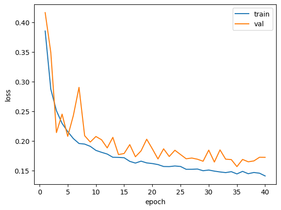
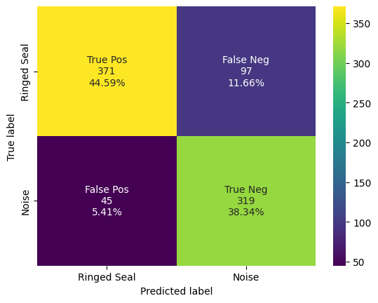

# Ringed Seal Detector

This notebook has the final code used to create the ringed seal detector. 

## Import Packages


```python
import pandas as pd
import numpy as np
import tensorflow as tf
import seaborn as sns
import shutil
import os 
import csv
import matplotlib.pyplot as plt
from sklearn.metrics import confusion_matrix

from ketos.data_handling import selection_table as sl
import ketos.data_handling.database_interface as dbi
from ketos.data_handling.parsing import load_audio_representation
from ketos.data_handling.data_feeding import BatchGenerator
from ketos.neural_networks.resnet import ResNetInterface
from ketos.audio.audio_loader import AudioFrameLoader, AudioLoader, SelectionTableIterator
from ketos.audio.spectrogram import MagSpectrogram
from ketos.neural_networks.dev_utils.detection import batch_load_audio_file_data, filter_by_threshold
from ketos.data_handling.data_feeding import JointBatchGen

import warnings
warnings.simplefilter(action='ignore', category=FutureWarning)

print('done importing packages')
```

    done importing packages
    

## User Inputs


```python
# Load in user inputs 
main_folder = r'C:\Users\kzammit\Documents\Detector\manual_detector_2sec'
neg_folder = main_folder + '\\' + r'inputs\annotations\edited_sels\negatives'
pos_folder = main_folder + '\\' + r'inputs\annotations\edited_sels\positives'
spec_file = main_folder + '\\' + r'inputs\spec_config_2sec.json'
data_folder = r'D:\ringed-seal-data'
db_name = main_folder + '\\' r'manual_database_2sec.h5'
recipe = main_folder + '\\' + r'inputs\resnet_recipe.json'
output_name = main_folder + '\\' + 'rs-2sec.kt'

# Define the split for the training, validation, and test datasets from each site 
ulu_vals = [634, 179, 88]
ulu2022_vals = [949, 274, 139]
kk_vals = [1230, 348, 171]
cb_vals = [130, 37, 18]
```

## Step One: Create Database 

A database consisting of manually verified spectrogram segments is created using excel workbooks.


```python
## Create Database ##

# negatives tables and standarize for ketos
ulu_neg = pd.read_excel(neg_folder + '\\' + 'std_ULU_negatives-manual-FINAL.xlsx')
ulu_neg = ulu_neg.ffill()
ulu_neg = sl.standardize(table=ulu_neg)
print('Negatives standardized? ' + str(sl.is_standardized(ulu_neg)))

ulu2022_neg = pd.read_excel(neg_folder + '\\' + 'std_ULU2022_negatives-manual-FINAL.xlsx')
ulu2022_neg = ulu2022_neg.ffill()
ulu2022_neg = sl.standardize(table=ulu2022_neg)
print('Negatives standardized? ' + str(sl.is_standardized(ulu2022_neg)))

kk_neg = pd.read_excel(neg_folder + '\\' + 'std_KK_negatives-manual-FINAL.xlsx')
kk_neg = kk_neg.ffill()
kk_neg = sl.standardize(table=kk_neg)
print('Negatives standardized? ' + str(sl.is_standardized(kk_neg)))

cb_neg = pd.read_excel(neg_folder + '\\' + 'std_CB_negatives-manual-FINAL.xlsx')
cb_neg = cb_neg.ffill()
cb_neg = sl.standardize(table=cb_neg)
print('Negatives standardized? ' + str(sl.is_standardized(cb_neg)))

# positives tables
ulu_pos = pd.read_excel(pos_folder + '\\' + 'std_ULU_positives.xlsx')
ulu_pos = ulu_pos.ffill()
ulu_pos = sl.standardize(table=ulu_pos, start_labels_at_1=True)
print('Positives standardized? ' + str(sl.is_standardized(ulu_pos)))

ulu2022_pos = pd.read_excel(pos_folder + '\\' + 'std_ULU2022_positives.xlsx')
ulu2022_pos = ulu2022_pos.ffill()
ulu2022_pos = sl.standardize(table=ulu2022_pos, start_labels_at_1=True)
print('Positives standardized? ' + str(sl.is_standardized(ulu2022_pos)))

kk_pos = pd.read_excel(pos_folder + '\\' + 'std_KK_positives.xlsx')
kk_pos = kk_pos.ffill()
kk_pos = sl.standardize(table=kk_pos, start_labels_at_1=True)
print('Positives standardized? ' + str(sl.is_standardized(kk_pos)))

cb_pos = pd.read_excel(pos_folder + '\\' + 'std_CB_positives.xlsx')
cb_pos = cb_pos.ffill()
cb_pos = sl.standardize(table=cb_pos, start_labels_at_1=True)
print('Positives standardized? ' + str(sl.is_standardized(cb_pos)))

# join into complete tables

ulu_pos_tr = ulu_pos.head(ulu_vals[0])
ulu_pos_va = ulu_pos[ulu_vals[0]:ulu_vals[0] + ulu_vals[1]]
ulu_pos_te = ulu_pos.tail(ulu_vals[2])

ulu_neg_tr = ulu_neg.head(ulu_vals[0])
ulu_neg_va = ulu_neg[ulu_vals[0]:ulu_vals[0] + ulu_vals[1]]
ulu_neg_te = ulu_neg.tail(ulu_vals[2])

ulu_tr = pd.concat([ulu_pos_tr, ulu_neg_tr])
ulu_va = pd.concat([ulu_pos_va, ulu_neg_va])
ulu_te = pd.concat([ulu_pos_te, ulu_neg_te])

ulu2022_pos_tr = ulu2022_pos.head(ulu2022_vals[0])
ulu2022_pos_va = ulu2022_pos[ulu2022_vals[0]:ulu2022_vals[0] + ulu2022_vals[1]]
ulu2022_pos_te = ulu2022_pos.tail(ulu2022_vals[2])

ulu2022_neg_tr = ulu2022_neg.head(ulu2022_vals[0])
ulu2022_neg_va = ulu2022_neg[ulu2022_vals[0]:ulu2022_vals[0] + ulu2022_vals[1]]
ulu2022_neg_te = ulu2022_neg.tail(ulu2022_vals[2])

ulu2022_tr = pd.concat([ulu2022_pos_tr, ulu2022_neg_tr])
ulu2022_va = pd.concat([ulu2022_pos_va, ulu2022_neg_va])
ulu2022_te = pd.concat([ulu2022_pos_te, ulu2022_neg_te])

kk_pos_tr = kk_pos.head(kk_vals[0])
kk_pos_va = kk_pos[kk_vals[0]:kk_vals[0] + kk_vals[1]]
kk_pos_te = kk_pos.tail(kk_vals[2])

kk_neg_tr = kk_neg.head(kk_vals[0])
kk_neg_va = kk_neg[kk_vals[0]:kk_vals[0] + kk_vals[1]]
kk_neg_te = kk_neg.tail(kk_vals[2])

kk_tr = pd.concat([kk_pos_tr, kk_neg_tr])
kk_va = pd.concat([kk_pos_va, kk_neg_va])
kk_te = pd.concat([kk_pos_te, kk_neg_te])

cb_pos_tr = cb_pos.head(cb_vals[0])
cb_pos_va = cb_pos[cb_vals[0]:cb_vals[0] + cb_vals[1]]
cb_pos_te = cb_pos.tail(cb_vals[2])

cb_neg_tr = cb_neg.head(cb_vals[0])
cb_neg_va = cb_neg[cb_vals[0]:cb_vals[0] + cb_vals[1]]
cb_neg_te = cb_neg.tail(cb_vals[2])

cb_tr = pd.concat([cb_pos_tr, cb_neg_tr])
cb_va = pd.concat([cb_pos_va, cb_neg_va])
cb_te = pd.concat([cb_pos_te, cb_neg_te])

# final three tables

train = pd.concat([ulu_tr, ulu2022_tr, cb_tr, kk_tr])
val = pd.concat([ulu_va, ulu2022_va, cb_va, kk_va])
test = pd.concat([ulu_te, ulu2022_te, cb_te, kk_te])

# join into a database

# Load the spectrogram representation & parameters, this returns a dict 
spec_cfg = load_audio_representation(spec_file, name="spectrogram")

# Create a table called "train" in the database, defined by db_name, using the "train" selections table, the spectrogram config, and the audio data 
# Behind the hood, this creates an AudioLoader and AudioWriter Ketos function which generates the spectrograms for each selection 
# For the specific spectrogram in this case, the spectrograms are of size [1500,56] where 56 refers to the frequency dimension and 1500 refers to the time dimension 
# The size of the spectrogram is 1500*56, which is 84000
dbi.create_database(output_file=db_name,  # empty brackets
                    dataset_name=r'train', selections=train, data_dir=data_folder,
                    audio_repres=spec_cfg)

dbi.create_database(output_file=db_name,  # empty brackets
                    dataset_name=r'val', selections=val, data_dir=data_folder,
                    audio_repres=spec_cfg)

dbi.create_database(output_file=db_name,  # empty brackets
                    dataset_name=r'test', selections=test, data_dir=data_folder,
                    audio_repres=spec_cfg)
```

    Negatives standardized? True
    Negatives standardized? True
    Negatives standardized? True
    Negatives standardized? True
    Positives standardized? True
    Positives standardized? True
    Positives standardized? True
    Positives standardized? True
    

     25%|███████████████████▏                                                          | 1446/5886 [00:46<01:45, 41.96it/s]RuntimeWarning: Waveform padded with its own reflection to achieve required length to compute the stft. 57 samples were padded on the left and 0 samples were padded on the right
     31%|███████████████████████▉                                                      | 1808/5886 [00:57<01:53, 35.78it/s]RuntimeWarning: Waveform padded with its own reflection to achieve required length to compute the stft. 0 samples were padded on the left and 4 samples were padded on the right
     59%|█████████████████████████████████████████████▉                                | 3469/5886 [01:52<01:19, 30.59it/s]RuntimeWarning: Waveform padded with its own reflection to achieve required length to compute the stft. 16 samples were padded on the left and 0 samples were padded on the right
    100%|██████████████████████████████████████████████████████████████████████████████| 5886/5886 [03:02<00:00, 32.29it/s]
    

    5886 items saved to C:\Users\kzammit\Documents\Detector\manual_detector_2sec\manual_database_2sec.h5
    

    100%|██████████████████████████████████████████████████████████████████████████████| 1676/1676 [00:50<00:00, 33.41it/s]
    

    1676 items saved to C:\Users\kzammit\Documents\Detector\manual_detector_2sec\manual_database_2sec.h5
    

    100%|████████████████████████████████████████████████████████████████████████████████| 832/832 [00:25<00:00, 33.05it/s]

    832 items saved to C:\Users\kzammit\Documents\Detector\manual_detector_2sec\manual_database_2sec.h5
    

    
    


```python
# Save the final excel sheets for future reference 
train.to_excel(main_folder + '\\' + 'sel_train.xlsx')
val.to_excel(main_folder + '\\' + 'sel_val.xlsx')
test.to_excel(main_folder + '\\' + 'sel_test.xlsx')
```

## Step Two: Train Classifier


```python
# Set the random seed for numpy and tensorflow 
np.random.seed(1000)
tf.random.set_seed(2000)

# Set the batch size and number of epochs for training
batch_size = 16
n_epochs = 40

# Set the log folder and checkpoint folder 
log_folder = main_folder + '\\' + 'logs'
checkpoint_folder = main_folder + '\\' + 'checkpoints'

# Open the database file in read mode
db = dbi.open_file(db_name, 'r')

# Open the training and validation tables respectively 
train_data = dbi.open_table(db, "/train/data")
val_data = dbi.open_table(db, "/val/data")

# Create batches of training data of size batch size, using the specified data table 
# This returns indices of the data in each batch along with their labels 
train_generator = BatchGenerator(batch_size=batch_size, data_table=train_data,
                                    output_transform_func=ResNetInterface.transform_batch,
                                    shuffle=True, refresh_on_epoch_end=True)

# Create batches of validation data of size batch size, using the specified data table 
# This returns indices of the data in each batch along with their labels 
val_generator = BatchGenerator(batch_size=batch_size, data_table=val_data,
                                   output_transform_func=ResNetInterface.transform_batch,
                                   shuffle=False, refresh_on_epoch_end=False)

# Build the ResNet model file based off of the recipe file - this creates a "ResNetInterface" object 
resnet = ResNetInterface.build(recipe)

# Set the training and validation generators to the batch generators created above 
resnet.train_generator = train_generator
resnet.val_generator = val_generator

# Set the model log and checkpoint directory 
resnet.log_dir = log_folder
resnet.checkpoint_dir = checkpoint_folder

# Train the model, looping through all of the training and validation data 
# See code map for more information
resnet.train_loop(n_epochs=n_epochs, verbose=True, log_csv=True, csv_name='log.csv')

# Close the database 
db.close()

# Save the model file, and keep track of the spectrogram parameters used to generate that model 
resnet.save(output_name, audio_repr_file=spec_file)
```

    UserWarning: The `lr` argument is deprecated, use `learning_rate` instead.
    

    
    ====================================================================================
    Epoch: 1 
    train_loss: 0.3850531578063965
    train_CategoricalAccuracy: 0.664 train_Precision: 0.729 train_Recall: 0.520 
    

    FutureWarning: The behavior of DataFrame concatenation with empty or all-NA entries is deprecated. In a future version, this will no longer exclude empty or all-NA columns when determining the result dtypes. To retain the old behavior, exclude the relevant entries before the concat operation.
    

    val_loss: 0.4160297214984894
    val_CategoricalAccuracy: 0.600 val_Precision: 0.563 val_Recall: 0.893 
    
    ====================================================================================
    
    ====================================================================================
    Epoch: 2 
    train_loss: 0.28704074025154114
    train_CategoricalAccuracy: 0.766 train_Precision: 0.821 train_Recall: 0.681 
    val_loss: 0.34895119071006775
    val_CategoricalAccuracy: 0.661 val_Precision: 0.688 val_Recall: 0.591 
    
    ====================================================================================
    
    ====================================================================================
    Epoch: 3 
    train_loss: 0.25078943371772766
    train_CategoricalAccuracy: 0.795 train_Precision: 0.841 train_Recall: 0.728 
    val_loss: 0.21398672461509705
    val_CategoricalAccuracy: 0.834 val_Precision: 0.840 val_Recall: 0.823 
    
    ====================================================================================
    
    ====================================================================================
    Epoch: 4 
    train_loss: 0.2294774204492569
    train_CategoricalAccuracy: 0.817 train_Precision: 0.861 train_Recall: 0.756 
    val_loss: 0.24504035711288452
    val_CategoricalAccuracy: 0.831 val_Precision: 0.868 val_Recall: 0.779 
    
    ====================================================================================
    
    ====================================================================================
    Epoch: 5 
    train_loss: 0.21560479700565338
    train_CategoricalAccuracy: 0.829 train_Precision: 0.865 train_Recall: 0.780 
    val_loss: 0.20765075087547302
    val_CategoricalAccuracy: 0.827 val_Precision: 0.869 val_Recall: 0.770 
    
    ====================================================================================
    
    ====================================================================================
    Epoch: 6 
    train_loss: 0.20385189354419708
    train_CategoricalAccuracy: 0.841 train_Precision: 0.870 train_Recall: 0.801 
    val_loss: 0.2428032010793686
    val_CategoricalAccuracy: 0.785 val_Precision: 0.883 val_Recall: 0.658 
    
    ====================================================================================
    
    ====================================================================================
    Epoch: 7 
    train_loss: 0.1955978274345398
    train_CategoricalAccuracy: 0.849 train_Precision: 0.874 train_Recall: 0.815 
    val_loss: 0.29008790850639343
    val_CategoricalAccuracy: 0.731 val_Precision: 0.676 val_Recall: 0.887 
    
    ====================================================================================
    
    ====================================================================================
    Epoch: 8 
    train_loss: 0.1945890188217163
    train_CategoricalAccuracy: 0.848 train_Precision: 0.872 train_Recall: 0.816 
    val_loss: 0.20871391892433167
    val_CategoricalAccuracy: 0.811 val_Precision: 0.868 val_Recall: 0.733 
    
    ====================================================================================
    
    ====================================================================================
    Epoch: 9 
    train_loss: 0.19079051911830902
    train_CategoricalAccuracy: 0.850 train_Precision: 0.878 train_Recall: 0.813 
    val_loss: 0.19803009927272797
    val_CategoricalAccuracy: 0.866 val_Precision: 0.846 val_Recall: 0.896 
    
    ====================================================================================
    
    ====================================================================================
    Epoch: 10 
    train_loss: 0.18396660685539246
    train_CategoricalAccuracy: 0.855 train_Precision: 0.877 train_Recall: 0.827 
    val_loss: 0.2073792815208435
    val_CategoricalAccuracy: 0.827 val_Precision: 0.888 val_Recall: 0.748 
    
    ====================================================================================
    
    ====================================================================================
    Epoch: 11 
    train_loss: 0.18073037266731262
    train_CategoricalAccuracy: 0.859 train_Precision: 0.880 train_Recall: 0.832 
    val_loss: 0.20186389982700348
    val_CategoricalAccuracy: 0.832 val_Precision: 0.887 val_Recall: 0.760 
    
    ====================================================================================
    
    ====================================================================================
    Epoch: 12 
    train_loss: 0.17782694101333618
    train_CategoricalAccuracy: 0.863 train_Precision: 0.882 train_Recall: 0.839 
    val_loss: 0.18818964064121246
    val_CategoricalAccuracy: 0.833 val_Precision: 0.872 val_Recall: 0.780 
    
    ====================================================================================
    
    ====================================================================================
    Epoch: 13 
    train_loss: 0.17239366471767426
    train_CategoricalAccuracy: 0.863 train_Precision: 0.888 train_Recall: 0.831 
    val_loss: 0.20594049990177155
    val_CategoricalAccuracy: 0.819 val_Precision: 0.872 val_Recall: 0.748 
    
    ====================================================================================
    
    ====================================================================================
    Epoch: 14 
    train_loss: 0.17219214141368866
    train_CategoricalAccuracy: 0.868 train_Precision: 0.890 train_Recall: 0.840 
    val_loss: 0.17692813277244568
    val_CategoricalAccuracy: 0.857 val_Precision: 0.859 val_Recall: 0.853 
    
    ====================================================================================
    
    ====================================================================================
    Epoch: 15 
    train_loss: 0.17162691056728363
    train_CategoricalAccuracy: 0.867 train_Precision: 0.890 train_Recall: 0.838 
    val_loss: 0.17873962223529816
    val_CategoricalAccuracy: 0.845 val_Precision: 0.879 val_Recall: 0.801 
    
    ====================================================================================
    
    ====================================================================================
    Epoch: 16 
    train_loss: 0.1655074506998062
    train_CategoricalAccuracy: 0.873 train_Precision: 0.892 train_Recall: 0.848 
    val_loss: 0.19373196363449097
    val_CategoricalAccuracy: 0.832 val_Precision: 0.893 val_Recall: 0.755 
    
    ====================================================================================
    
    ====================================================================================
    Epoch: 17 
    train_loss: 0.16262003779411316
    train_CategoricalAccuracy: 0.876 train_Precision: 0.894 train_Recall: 0.854 
    val_loss: 0.17327801883220673
    val_CategoricalAccuracy: 0.852 val_Precision: 0.882 val_Recall: 0.813 
    
    ====================================================================================
    
    ====================================================================================
    Epoch: 18 
    train_loss: 0.16585305333137512
    train_CategoricalAccuracy: 0.873 train_Precision: 0.891 train_Recall: 0.849 
    val_loss: 0.18312488496303558
    val_CategoricalAccuracy: 0.845 val_Precision: 0.881 val_Recall: 0.797 
    
    ====================================================================================
    
    ====================================================================================
    Epoch: 19 
    train_loss: 0.16290777921676636
    train_CategoricalAccuracy: 0.872 train_Precision: 0.892 train_Recall: 0.845 
    val_loss: 0.20278652012348175
    val_CategoricalAccuracy: 0.822 val_Precision: 0.898 val_Recall: 0.727 
    
    ====================================================================================
    
    ====================================================================================
    Epoch: 20 
    train_loss: 0.16183023154735565
    train_CategoricalAccuracy: 0.875 train_Precision: 0.893 train_Recall: 0.851 
    val_loss: 0.18664821982383728
    val_CategoricalAccuracy: 0.835 val_Precision: 0.888 val_Recall: 0.767 
    
    ====================================================================================
    
    ====================================================================================
    Epoch: 21 
    train_loss: 0.16009952127933502
    train_CategoricalAccuracy: 0.877 train_Precision: 0.900 train_Recall: 0.849 
    val_loss: 0.16957400739192963
    val_CategoricalAccuracy: 0.851 val_Precision: 0.869 val_Recall: 0.828 
    
    ====================================================================================
    
    ====================================================================================
    Epoch: 22 
    train_loss: 0.15685218572616577
    train_CategoricalAccuracy: 0.878 train_Precision: 0.901 train_Recall: 0.849 
    val_loss: 0.18662525713443756
    val_CategoricalAccuracy: 0.841 val_Precision: 0.896 val_Recall: 0.771 
    
    ====================================================================================
    
    ====================================================================================
    Epoch: 23 
    train_loss: 0.15670102834701538
    train_CategoricalAccuracy: 0.882 train_Precision: 0.901 train_Recall: 0.858 
    val_loss: 0.1736879050731659
    val_CategoricalAccuracy: 0.850 val_Precision: 0.885 val_Recall: 0.805 
    
    ====================================================================================
    
    ====================================================================================
    Epoch: 24 
    train_loss: 0.15772928297519684
    train_CategoricalAccuracy: 0.876 train_Precision: 0.898 train_Recall: 0.848 
    val_loss: 0.18421532213687897
    val_CategoricalAccuracy: 0.839 val_Precision: 0.890 val_Recall: 0.773 
    
    ====================================================================================
    
    ====================================================================================
    Epoch: 25 
    train_loss: 0.15689857304096222
    train_CategoricalAccuracy: 0.878 train_Precision: 0.896 train_Recall: 0.856 
    val_loss: 0.1770048439502716
    val_CategoricalAccuracy: 0.847 val_Precision: 0.885 val_Recall: 0.798 
    
    ====================================================================================
    
    ====================================================================================
    Epoch: 26 
    train_loss: 0.15211337804794312
    train_CategoricalAccuracy: 0.883 train_Precision: 0.904 train_Recall: 0.857 
    val_loss: 0.16987864673137665
    val_CategoricalAccuracy: 0.857 val_Precision: 0.886 val_Recall: 0.820 
    
    ====================================================================================
    
    ====================================================================================
    Epoch: 27 
    train_loss: 0.15217913687229156
    train_CategoricalAccuracy: 0.883 train_Precision: 0.905 train_Recall: 0.855 
    val_loss: 0.17109431326389313
    val_CategoricalAccuracy: 0.853 val_Precision: 0.884 val_Recall: 0.813 
    
    ====================================================================================
    
    ====================================================================================
    Epoch: 28 
    train_loss: 0.15260499715805054
    train_CategoricalAccuracy: 0.881 train_Precision: 0.902 train_Recall: 0.856 
    val_loss: 0.16910941898822784
    val_CategoricalAccuracy: 0.860 val_Precision: 0.892 val_Recall: 0.819 
    
    ====================================================================================
    
    ====================================================================================
    Epoch: 29 
    train_loss: 0.14971280097961426
    train_CategoricalAccuracy: 0.881 train_Precision: 0.908 train_Recall: 0.849 
    val_loss: 0.1657201647758484
    val_CategoricalAccuracy: 0.853 val_Precision: 0.875 val_Recall: 0.822 
    
    ====================================================================================
    
    ====================================================================================
    Epoch: 30 
    train_loss: 0.15088406205177307
    train_CategoricalAccuracy: 0.881 train_Precision: 0.899 train_Recall: 0.859 
    val_loss: 0.18443647027015686
    val_CategoricalAccuracy: 0.842 val_Precision: 0.891 val_Recall: 0.779 
    
    ====================================================================================
    
    ====================================================================================
    Epoch: 31 
    train_loss: 0.1490722894668579
    train_CategoricalAccuracy: 0.885 train_Precision: 0.908 train_Recall: 0.857 
    val_loss: 0.16438396275043488
    val_CategoricalAccuracy: 0.856 val_Precision: 0.877 val_Recall: 0.827 
    
    ====================================================================================
    
    ====================================================================================
    Epoch: 32 
    train_loss: 0.14768122136592865
    train_CategoricalAccuracy: 0.885 train_Precision: 0.904 train_Recall: 0.861 
    val_loss: 0.18483397364616394
    val_CategoricalAccuracy: 0.834 val_Precision: 0.899 val_Recall: 0.752 
    
    ====================================================================================
    
    ====================================================================================
    Epoch: 33 
    train_loss: 0.14655007421970367
    train_CategoricalAccuracy: 0.888 train_Precision: 0.909 train_Recall: 0.861 
    val_loss: 0.16918635368347168
    val_CategoricalAccuracy: 0.854 val_Precision: 0.891 val_Recall: 0.807 
    
    ====================================================================================
    
    ====================================================================================
    Epoch: 34 
    train_loss: 0.14814941585063934
    train_CategoricalAccuracy: 0.886 train_Precision: 0.900 train_Recall: 0.868 
    val_loss: 0.1685107797384262
    val_CategoricalAccuracy: 0.860 val_Precision: 0.893 val_Recall: 0.819 
    
    ====================================================================================
    
    ====================================================================================
    Epoch: 35 
    train_loss: 0.1443675458431244
    train_CategoricalAccuracy: 0.891 train_Precision: 0.907 train_Recall: 0.871 
    val_loss: 0.15666572749614716
    val_CategoricalAccuracy: 0.867 val_Precision: 0.871 val_Recall: 0.862 
    
    ====================================================================================
    
    ====================================================================================
    Epoch: 36 
    train_loss: 0.14864932000637054
    train_CategoricalAccuracy: 0.881 train_Precision: 0.899 train_Recall: 0.857 
    val_loss: 0.16876107454299927
    val_CategoricalAccuracy: 0.860 val_Precision: 0.883 val_Recall: 0.829 
    
    ====================================================================================
    
    ====================================================================================
    Epoch: 37 
    train_loss: 0.14469391107559204
    train_CategoricalAccuracy: 0.888 train_Precision: 0.905 train_Recall: 0.866 
    val_loss: 0.1647948920726776
    val_CategoricalAccuracy: 0.857 val_Precision: 0.888 val_Recall: 0.817 
    
    ====================================================================================
    
    ====================================================================================
    Epoch: 38 
    train_loss: 0.14677362143993378
    train_CategoricalAccuracy: 0.888 train_Precision: 0.907 train_Recall: 0.865 
    val_loss: 0.16622279584407806
    val_CategoricalAccuracy: 0.856 val_Precision: 0.891 val_Recall: 0.811 
    
    ====================================================================================
    
    ====================================================================================
    Epoch: 39 
    train_loss: 0.14556707441806793
    train_CategoricalAccuracy: 0.888 train_Precision: 0.907 train_Recall: 0.865 
    val_loss: 0.17239390313625336
    val_CategoricalAccuracy: 0.845 val_Precision: 0.890 val_Recall: 0.789 
    
    ====================================================================================
    
    ====================================================================================
    Epoch: 40 
    train_loss: 0.14096249639987946
    train_CategoricalAccuracy: 0.888 train_Precision: 0.907 train_Recall: 0.865 
    val_loss: 0.17227515578269958
    val_CategoricalAccuracy: 0.851 val_Precision: 0.890 val_Recall: 0.801 
    
    ====================================================================================
    

### Plots 


```python
# Get path to folder containing logs 
log_folder = main_folder + '\\' + 'logs'

# Read the log file 
log_file = pd.read_csv(log_folder + '\\' + 'log.csv')

# Get the training and validation losses 
tr_results = log_file[log_file['dataset']=='train']
va_results = log_file[log_file['dataset']=='val']

# Plot the loss curves 
sns.lineplot(data=tr_results, x='epoch', y='loss', label='train', legend='auto')
sns.lineplot(data=va_results, x='epoch', y='loss', label='val', legend='auto')   
```


    <Axes: xlabel='epoch', ylabel='loss'>


    

    


## Step Three: Deploy Detector

### Copy Testing Files to Audio Folder


```python
import shutil

# Necessary for other steps 
test_filled = test.reset_index(allow_duplicates=True)

# Set pathway to audio folder 
audio_folder = main_folder + '\\' + 'audio'

# Copy files from main data folder into audio folder if they match the testing dataframe files 
for idex, row in test_filled.iterrows():
    shutil.copyfile(test_filled.loc[idex]['filename'], audio_folder + '\\' + test_filled.loc[idex]['filename'].split('\\')[-1])

print('done')
```

    done
    

### Deploy Detector on Audio Data


```python
# Set the temp folder, detections csv, detections threshold, step size, batch size, and buffer 
temp_folder = main_folder + '\\' + 'ringedS_tmp_folder'
detections_csv = main_folder + '\\' + 'detections_raw.csv'
threshold = 0.5
step_size = 2.0
batch_size = 16
buffer = 0.5 
```


```python
# Load the already trained model file 
model = ResNetInterface.load(model_file=output_name, new_model_folder=temp_folder)

# Load the audio representation (dict)
audio_repr = load_audio_representation(path=spec_file)

# Get the config from the "spectrogram" audio representation
# This is helpful if I had "waveform" as well in the representation options as well 
spec_config = audio_repr['spectrogram']

# Create an audioFrameLoader containing the spectrogram parameters and type 
audio_loader = AudioFrameLoader(path=audio_folder, duration=spec_config['duration'],
                                    step=step_size, stop=False, representation=spec_config['type'],
                                    representation_params=spec_config, pad=False)

# Initialize a detections dataframe 
detections = pd.DataFrame()

# Load the audio data in the defined batch size with the audio loader object 
batch_generator = batch_load_audio_file_data(loader=audio_loader, batch_size=batch_size)

# for each batch
for batch_data in batch_generator:
    
    # Run the model on the spectrogram data from the current batch
    batch_predictions = model.run_on_batch(batch_data['data'], return_raw_output=True)

    # Lets store our data in a dictionary
    raw_output = {'filename': batch_data['filename'], 'start': batch_data['start'], 'end': batch_data['end'],
                  'score': batch_predictions}

    # Filter the raw detections by the threshold, dropping detections below the threshold 
    # will be a dataframe with the filename, start, end, label, and score 
    batch_detections = filter_by_threshold(raw_output, threshold=threshold)

    # Add these detections to the detections dataframe 
    detections = pd.concat([detections, batch_detections], ignore_index=True)

# Output the detections that were over a threshold to a csv file
detections.to_csv(detections_csv, index=False)
```

      0%|                                                                                         | 0/1927 [00:00<?, ?it/s]RuntimeWarning: Waveform padded with its own reflection to achieve required length to compute the stft. 73 samples were padded on the left and 0 samples were padded on the right
      5%|███▊                                                                            | 93/1927 [00:12<04:17,  7.13it/s]RuntimeWarning: Waveform padded with its own reflection to achieve required length to compute the stft. 0 samples were padded on the left and 76 samples were padded on the right
     46%|███████████████████████████████████▉                                           | 878/1927 [02:39<03:22,  5.18it/s]RuntimeWarning: Waveform padded with its own reflection to achieve required length to compute the stft. 0 samples were padded on the left and 75 samples were padded on the right
     46%|████████████████████████████████████▎                                          | 887/1927 [02:41<03:20,  5.18it/s]RuntimeWarning: Waveform padded with its own reflection to achieve required length to compute the stft. 0 samples were padded on the left and 53 samples were padded on the right
     46%|████████████████████████████████████▋                                          | 896/1927 [02:43<03:29,  4.92it/s]RuntimeWarning: Waveform padded with its own reflection to achieve required length to compute the stft. 0 samples were padded on the left and 18 samples were padded on the right
     50%|███████████████████████████████████████▍                                       | 962/1927 [02:56<03:15,  4.93it/s]RuntimeWarning: Waveform padded with its own reflection to achieve required length to compute the stft. 0 samples were padded on the left and 58 samples were padded on the right
     51%|████████████████████████████████████████▏                                      | 981/1927 [03:00<03:08,  5.03it/s]RuntimeWarning: Waveform padded with its own reflection to achieve required length to compute the stft. 0 samples were padded on the left and 73 samples were padded on the right
     53%|█████████████████████████████████████████▏                                    | 1018/1927 [03:08<03:37,  4.18it/s]RuntimeWarning: Waveform padded with its own reflection to achieve required length to compute the stft. 0 samples were padded on the left and 65 samples were padded on the right
     55%|██████████████████████████████████████████▋                                   | 1056/1927 [03:16<02:55,  4.95it/s]RuntimeWarning: Waveform padded with its own reflection to achieve required length to compute the stft. 0 samples were padded on the left and 51 samples were padded on the right
     57%|████████████████████████████████████████████▌                                 | 1102/1927 [03:25<02:51,  4.81it/s]RuntimeWarning: Waveform padded with its own reflection to achieve required length to compute the stft. 0 samples were padded on the left and 49 samples were padded on the right
     60%|██████████████████████████████████████████████▌                               | 1149/1927 [03:35<02:41,  4.81it/s]RuntimeWarning: Waveform padded with its own reflection to achieve required length to compute the stft. 0 samples were padded on the left and 20 samples were padded on the right
     61%|███████████████████████████████████████████████▋                              | 1177/1927 [03:40<02:23,  5.24it/s]RuntimeWarning: Waveform padded with its own reflection to achieve required length to compute the stft. 0 samples were padded on the left and 50 samples were padded on the right
     62%|████████████████████████████████████████████████                              | 1187/1927 [03:42<02:21,  5.24it/s]RuntimeWarning: Waveform padded with its own reflection to achieve required length to compute the stft. 0 samples were padded on the left and 61 samples were padded on the right
     64%|█████████████████████████████████████████████████▉                            | 1234/1927 [03:51<02:34,  4.49it/s]RuntimeWarning: Waveform padded with its own reflection to achieve required length to compute the stft. 0 samples were padded on the left and 22 samples were padded on the right
     65%|██████████████████████████████████████████████████▎                           | 1243/1927 [03:53<02:24,  4.72it/s]RuntimeWarning: Waveform padded with its own reflection to achieve required length to compute the stft. 0 samples were padded on the left and 57 samples were padded on the right
     68%|████████████████████████████████████████████████████▉                         | 1308/1927 [04:07<01:57,  5.28it/s]RuntimeWarning: Waveform padded with its own reflection to achieve required length to compute the stft. 0 samples were padded on the left and 60 samples were padded on the right
     69%|██████████████████████████████████████████████████████                        | 1337/1927 [04:12<01:57,  5.03it/s]RuntimeWarning: Waveform padded with its own reflection to achieve required length to compute the stft. 0 samples were padded on the left and 54 samples were padded on the right
     70%|██████████████████████████████████████████████████████▍                       | 1346/1927 [04:14<02:00,  4.81it/s]RuntimeWarning: Waveform padded with its own reflection to achieve required length to compute the stft. 0 samples were padded on the left and 3 samples were padded on the right
     72%|███████████████████████████████████████████████████████▉                      | 1383/1927 [04:22<01:47,  5.08it/s]RuntimeWarning: Waveform padded with its own reflection to achieve required length to compute the stft. 0 samples were padded on the left and 14 samples were padded on the right
     75%|██████████████████████████████████████████████████████████▋                   | 1449/1927 [04:35<01:44,  4.58it/s]RuntimeWarning: Waveform padded with its own reflection to achieve required length to compute the stft. 0 samples were padded on the left and 39 samples were padded on the right
     77%|███████████████████████████████████████████████████████████▊                  | 1477/1927 [04:41<01:36,  4.66it/s]RuntimeWarning: Waveform padded with its own reflection to achieve required length to compute the stft. 0 samples were padded on the left and 10 samples were padded on the right
     78%|████████████████████████████████████████████████████████████▌                 | 1496/1927 [04:45<01:34,  4.55it/s]RuntimeWarning: Waveform padded with its own reflection to achieve required length to compute the stft. 0 samples were padded on the left and 42 samples were padded on the right
     80%|██████████████████████████████████████████████████████████████                | 1533/1927 [04:53<01:16,  5.18it/s]RuntimeWarning: Waveform padded with its own reflection to achieve required length to compute the stft. 0 samples were padded on the left and 28 samples were padded on the right
     83%|████████████████████████████████████████████████████████████████▋             | 1599/1927 [05:06<01:05,  5.02it/s]RuntimeWarning: Waveform padded with its own reflection to achieve required length to compute the stft. 0 samples were padded on the left and 9 samples were padded on the right
     85%|██████████████████████████████████████████████████████████████████▌           | 1645/1927 [05:15<00:54,  5.20it/s]RuntimeWarning: Waveform padded with its own reflection to achieve required length to compute the stft. 0 samples were padded on the left and 68 samples were padded on the right
     86%|███████████████████████████████████████████████████████████████████▎          | 1664/1927 [05:19<00:54,  4.79it/s]RuntimeWarning: Waveform padded with its own reflection to achieve required length to compute the stft. 0 samples were padded on the left and 55 samples were padded on the right
     92%|███████████████████████████████████████████████████████████████████████▌      | 1767/1927 [05:40<00:31,  5.07it/s]RuntimeWarning: Waveform padded with its own reflection to achieve required length to compute the stft. 0 samples were padded on the left and 69 samples were padded on the right
     92%|███████████████████████████████████████████████████████████████████████▉      | 1776/1927 [05:41<00:29,  5.11it/s]RuntimeWarning: Waveform padded with its own reflection to achieve required length to compute the stft. 0 samples were padded on the left and 37 samples were padded on the right
     95%|█████████████████████████████████████████████████████████████████████████▊    | 1823/1927 [05:51<00:21,  4.83it/s]RuntimeWarning: Waveform padded with its own reflection to achieve required length to compute the stft. 0 samples were padded on the left and 6 samples were padded on the right
     99%|█████████████████████████████████████████████████████████████████████████████▏| 1907/1927 [06:08<00:03,  5.07it/s]RuntimeWarning: Waveform padded with its own reflection to achieve required length to compute the stft. 0 samples were padded on the left and 64 samples were padded on the right
    100%|██████████████████████████████████████████████████████████████████████████████| 1927/1927 [06:12<00:00,  5.17it/s]
    

## Compare Results


```python
def compute_detections(labels, scores, threshold=0.5):

    # Compute the positive scores above threshold, 1 if it is above threshold, 0 if it is not 
    predictions = np.where(scores >= threshold, 1,0)

    # TP: Does the annotated label match the prediction above threshold? Bc "scores" is defined as the positive threshold, this represents TP
    TP = tf.math.count_nonzero(predictions * labels).numpy()

    # TN: Negative score is "predictions - 1" bc predictions was for the positive result, labels-1 so that the negatives are multiplied by 1
    TN = tf.math.count_nonzero((predictions - 1) * (labels - 1)).numpy()

    # And so on 
    FP = tf.math.count_nonzero(predictions * (labels - 1)).numpy()
    FN = tf.math.count_nonzero((predictions - 1) * labels).numpy()

    return predictions, TP, TN, FP, FN
```


```python
# Get pathway to metrics folder 
output_dir = main_folder + '\\' + 'metrics'

# Open the database in read only file 
db = dbi.open_file(db_name, 'r')

# Load the trained model
model = ResNetInterface.load(output_name, load_audio_repr=False, new_model_folder=temp_folder)

# Open the table in the database at the root level
table = dbi.open_table(db, '/test')

# Initialize Joint Batch Generator 
gens = []

# Calculate the batch_size fixing the original batch size so there are no remainders 
batch_size = int(batch_size / sum(1 for _ in db.walk_nodes(table, "Table")))

# for the testing dataset table in the database (or whatever table is passed in)
for group in db.walk_nodes(table, "Table"):

    # Create a batch generator for this table
    generator = BatchGenerator(batch_size=batch_size, data_table=group,
                               output_transform_func=ResNetInterface.transform_batch, shuffle=False,
                               refresh_on_epoch_end=False, x_field='data', return_batch_ids=True)

    # Append the generator to the gens array 
    gens.append(generator)

# Create a joint batch generator if multiple tables are passed through 
gen = JointBatchGen(gens, n_batches='min', shuffle_batch=False, reset_generators=False, return_batch_ids=True)

# Initialize the scores and labels 
scores = []
labels = []

# For each batch in the joint batch generator 
for batch_id in range(gen.n_batches):

    # Get the ids, spectrograms, and labels for the data in the batch
    hdf5_ids, batch_X, batch_Y = next(gen)

    # Get the labels for the batch data, using the "argmax" func which returns the col header, so 0 is a noise segment, 1 is a rs segment 
    batch_labels = np.argmax(batch_Y, axis=1)

    # Returns the scores for the batch for the "positive" class - this is used in the compute detections function later on
    batch_scores = model.model.predict_on_batch(batch_X)[:, 1]

    # Add these scores for this batch to the overall list
    scores.extend(batch_scores)
    labels.extend(batch_labels)

# Create a numpy array for the labels and scores for all batches 
labels = np.array(labels)
scores = np.array(scores)

# Compute the predictions, TP, TN, FP, and FN
# Predicted is an array are greater than a certain threshold, 1 for the score was, 0 for it was not 
predicted, TP, TN, FP, FN = compute_detections(labels, scores, threshold)

print(f'\nSaving detections output to {output_dir}/')

# Create the "classifications" csv file 
df_group = pd.DataFrame()
for group in db.walk_nodes(table, "Table"):
    df = pd.DataFrame({'id': group[:]['id'], 'filename': group[:]['filename']})
    df_group = pd.concat([df_group, df], ignore_index=True)
df_group['label'] = labels[:]
df_group['predicted'] = predicted[:]
df_group['score'] = scores[:]
df_group.to_csv(os.path.join(os.getcwd(), output_dir, "classifications.csv"), mode='w', index=False)

# Calculate performance metrics 
precision = TP / (TP + FP)
recall = TP / (TP + FN)
f1 = 2 * precision * recall / (precision + recall)
FPP = FP / (TN + FP)

# Create a confusion matrix 
confusion_matrix = [[TP, FN], [FP, TN]]

# Print the results 
print(f'\nPrecision: {precision}')
print(f'Recall: {recall}')
print(f'F1 Score: {f1}')
print('\nConfusionMatrix:')
print('\n[TP, FN]')
print('[FP, TN]')
print(f'{confusion_matrix[0]}')
print(f'{confusion_matrix[1]}')

# Save to an excel file 
print(f"\nSaving metrics to {output_dir}/")

# Saving precision recall and F1 Score for the defined thrshold
metrics = {'Precision': [precision], 'Recall': [recall], "F1 Score": [f1]}
metrics_df = pd.DataFrame(data=metrics)

metrics_df.to_csv(os.path.join(os.getcwd(), output_dir, "metrics.csv"), mode='w', index=False)

# Appending a confusion matrix to the file
row1 = ["Confusion Matrix", "Predicted"]
row2 = ["Actual", "RS", "Noise"]
row3 = ["RS", TP, FN]
row4 = ["Noise", FP, TN]
with open(os.path.join(os.getcwd(), output_dir, "metrics.csv"), 'a', encoding='UTF8') as f:
    writer = csv.writer(f)
    writer.writerow([])
    writer.writerow(row1)
    writer.writerow(row2)
    writer.writerow(row3)
    writer.writerow(row4)

db.close()
```

    
    Saving detections output to C:\Users\kzammit\Documents\Detector\manual_detector_2sec\metrics/
    
    Precision: 0.8763736263736264
    Recall: 0.7668269230769231
    F1 Score: 0.817948717948718
    
    ConfusionMatrix:
    
    [TP, FN]
    [FP, TN]
    [319, 97]
    [45, 371]
    
    Saving metrics to C:\Users\kzammit\Documents\Detector\manual_detector_2sec\metrics/
    


```python
def confusion_matrix_plot(cf, output_folder,
                          group_names=None,
                          categories='auto',
                          count=True,
                          percent=True,
                          cbar=True,
                          xyticks=True,
                          xyplotlabels=True,
                          sum_stats=True,
                          figsize=None,
                          cmap='Blues',
                          title=True):
    '''
    This function will make a pretty plot of an sklearn Confusion Matrix cm using a Seaborn heatmap visualization.

    Arguments
    ---------
    cf:            confusion matrix to be passed in

    group_names:   List of strings that represent the labels row by row to be shown in each square.

    categories:    List of strings containing the categories to be displayed on the x,y axis. Default is 'auto'

    count:         If True, show the raw number in the confusion matrix. Default is True.

    normalize:     If True, show the proportions for each category. Default is True.

    cbar:          If True, show the color bar. The cbar values are based off the values in the confusion matrix.
                   Default is True.

    xyticks:       If True, show x and y ticks. Default is True.

    xyplotlabels:  If True, show 'True Label' and 'Predicted Label' on the figure. Default is True.

    sum_stats:     If True, display summary statistics below the figure. Default is True.

    figsize:       Tuple representing the figure size. Default will be the matplotlib rcParams value.

    cmap:          Colormap of the values displayed from matplotlib.pyplot.cm. Default is 'Blues'
                   See http://matplotlib.org/examples/color/colormaps_reference.html

    title:         Title for the heatmap. Default is None.

    '''

    # CODE TO GENERATE TEXT INSIDE EACH SQUARE
    blanks = ['' for i in range(cf.size)]

    if group_names and len(group_names) == cf.size:
        group_labels = ["{}\n".format(value) for value in group_names]
    else:
        group_labels = blanks

    if count:
        group_counts = ["{0:0.0f}\n".format(value) for value in cf.flatten()]
    else:
        group_counts = blanks

    if percent:
        group_percentages = ["{0:.2%}".format(value) for value in cf.flatten() / np.sum(cf)]
    else:
        group_percentages = blanks

    box_labels = [f"{v1}{v2}{v3}".strip() for v1, v2, v3 in zip(group_labels, group_counts, group_percentages)]
    box_labels = np.asarray(box_labels).reshape(cf.shape[0], cf.shape[1])

    # CODE TO GENERATE SUMMARY STATISTICS & TEXT FOR SUMMARY STATS
    if sum_stats:
        # Accuracy is sum of diagonal divided by total observations
        accuracy = np.trace(cf) / float(np.sum(cf))

        # if it is a binary confusion matrix, show some more stats
        if len(cf) == 2:
            # Metrics for Binary Confusion Matrices
            precision = cf[1, 1] / sum(cf[:, 1])
            recall = cf[1, 1] / sum(cf[1, :])
            f1_score = 2 * precision * recall / (precision + recall)
            stats_text = "\n\nAccuracy={:0.3f}\nPrecision={:0.3f}\nRecall={:0.3f}\nF1 Score={:0.3f}".format(
                accuracy, precision, recall, f1_score)
        else:
            stats_text = "\n\nAccuracy={:0.3f}".format(accuracy)
    else:
        stats_text = ""

    # SET FIGURE PARAMETERS ACCORDING TO OTHER ARGUMENTS
    if figsize == None:
        # Get default figure size if not set
        figsize = plt.rcParams.get('figure.figsize')

    if xyticks == False:
        # Do not show categories if xyticks is False
        categories = False

    # MAKE THE HEATMAP VISUALIZATION
    plt.figure(figsize=figsize)
    sns.heatmap(cf, annot=box_labels, fmt="", cmap=cmap, cbar=cbar, xticklabels=categories, yticklabels=categories)

    if xyplotlabels:
        plt.ylabel('True label')
        #plt.xlabel('Predicted label' + stats_text)
        plt.xlabel('Predicted label')
    else:
        plt.xlabel(stats_text)

    if title:
        #plt.title(title)
        #plt.title(stats_text)
        print('no title')

    plt.savefig(output_folder + '\\' + 'confusion_matrix.png')
```


```python
classifications_file = output_dir + '\\' + 'classifications.csv'

classifications = pd.read_csv(classifications_file)

cm = confusion_matrix(classifications['predicted'], classifications['label'])

labels = ['True Pos', 'False Neg', 'False Pos', 'True Neg']
categories = ['Ringed Seal', 'Noise']

#confusion_matrix_plot(cm, output_dir, group_names=labels, categories=categories,
#                 cmap=sns.diverging_palette(20, 220, as_cmap=True))

confusion_matrix_plot(cm, output_dir, group_names=labels, categories=categories,
                 cmap='viridis')
```

    no title
    


    

    

