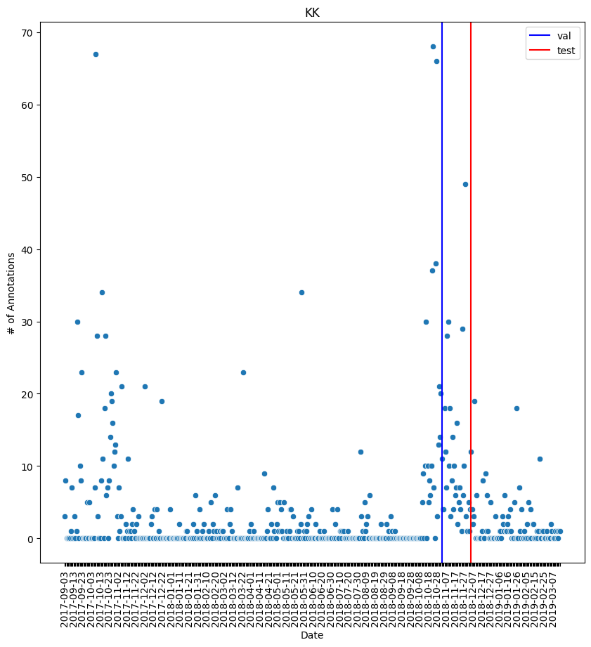

# Manual Dataset V1

## Final Manual Dataset (2023-11-16)

The below table represents a 68% "rest", 32% "ulu2022" split where "rest" refers to CB/KK/ULU for 
each of the training, validation and testing datasets. 

|        | CB (LT) | KK (LT) | ULU (LT) | ULU22 (ST) |
|--------|---------|---------|----------|------------|
| Train  | 130     | 1230    | 634      | 949        |
| Val    | 37      | 348     | 179      | 274        |
| Test   | 18      | 171     | 88       | 139        | 
| Totals | 185     | 1749    | 901      | 1362       | 

This is ensuring that 68% of each dataset is long-term deployments, "topped up" with the shorter,
better quality, ulu2022 deployments. Can be thought of as "long term deployments vs. short term 
deployments". 

Next step is to generate an equal number of noise segments per site, manually check them, 
and use this going forward.

### Checking Manual Dataset 

**Keys:**

- O: other than RS
- 0B: bearded seal
- OU: other signal unknown
- RS: ringed seal (or probably a ringed seal)
- OK: other knock like signal

If there is a ringed seal vocalization, pick another noise sample from the same wav file. 

- Negative segments were selected by: 
  - using full annotation tables containing vocalizations that were discarded so that no negative segments would be generated containing annotated RS vocalizations 
  - using the ketos function with a 4sec buffer and not allowing any overlap with existing annotations

| Segments          | CB  | KK   | PP  | ULU | ULU22 |
| ----------------- | --- | ---- |-----| --- | ----- |
| noise             | 185 | 1749 | 71  | 901 | 1362  |
| OK                | 14  | 85   | 11  | 292 | 170   |
| OB                | 73  | 26   | 4   | 19  | 106   |
| OU                | 6   | 92   | 5   | 109 | 38    |
| O                 | 87  | 1519 | 51  | 456 | 1046  |
| RS (replacements) | 5   | 27   | 0   | 25  | 2     |

| In percentages          | CB    | KK    | PP    | ULU   | ULU22 |
| ----------------------- | ----- | ----- | ----- | ----- | ----- |
| \# of OK                | 7.57  | 4.86  | 15.49 | 32.41 | 12.48 |
| \# of OB                | 39.46 | 1.49  | 5.63  | 2.11  | 7.78  |
| \# of OU                | 3.24  | 5.26  | 7.04  | 12.10 | 2.79  |
| \# of O                 | 47.03 | 86.85 | 71.83 | 50.61 | 76.80 |
| \# of RS (replacements) | 2.70  | 1.54  | 0.00  | 2.77  | 0.15  |

### Common Types of Noise 

- Knocks 
- Boat
- Water 
- Bearded seal
- Ice
- Electronic noise 
- Bowhead or other biological
- Instrument noise 

Ones that commonly confused me: knocking, scratching, water noise

## Process 

### Logic

- The data available in this project is both spatially and temporally biased 
  - Ulu2022 data is the best quality and represents the highest number of samples for that year and site 
  - Ulu2022 also was not a long term deployment which makes it different than the rest of the sites 
  - The rest of the sites (including Ulu 2017/2018) are long term deployments with highly variable data quality 
- So, create each dataset with the most CB/KK/Ulu1718 data as possible, topping up with Ulu 2022
- This will ensure the generalizability of the detector is maximized wrt to the available data
- Pierce point is being left out of the initial training process 
  - This is because then we will have a new site to test the fully trained detector to discuss the generalizability
  - Then we can do some fine-tuning of the model and discuss that the finished product that others can use is the fully trained model with the fine-tuning process 

#### How to do the topping up? 

- I decided to find the percentage split between all data exluding ulu2022 vs. ulu 2022
- All other data represents 68%, ulu2022 represents 32%
- So, in each dataset (train, val, test) use this same split to make sure the max of the other data is available, and then topped up with ulu2022

The total numbers end up being: 

|        | Ulu 2022 | Rest | Total |
| ------ | -------- | ---- | ----- |
| Train  | 949      | 1993 | 2942  |
| Val    | 274      | 564  | 838   |
| Test   | 139      | 278  | 417   |
| Totals | 1362     | 2835 | 4197  |

#### Time Dependence

Can we also account for time dependence in the rest of the sites? 

  - The ulu2022 data is all may, so exclude from this thought process
  - Ulu2022 can do random split for train/val/test 

Distributions:
- CB is positively skewed 
- KK is negatively skewed 
- Ulu is pretty evenly distributed after removing 2022 data 

I think what I'll do is pick a time for each site that makes the correct # of annots. 

### Steps 

1. Determine the number of annotations per month, per site 
2. Exclude PP
3. Determine the total number of annotations per site 
4. Isolate ulu2022 data as it's the best and most numerous

|                                    |      | CB  | KK   | ULU | ULU22 | CB/KK/ULU |
| ---------------------------------- | ---- | --- | ---- | --- | ----- | --------- |
| Total # of annotations (w out PP): | 4197 | 185 | 1749 | 901 | 1362  | 2835      |

5. Determine that ulu2022 data makes up for 32% of the annotations, and the rest make up for 68%
6. Recreate this split in the train, val, and test datasets 

| Sets  |     | \# of annots required | rnd  | ULU 2022 # | RD   | REST #  | RD   |
| ----- | --- | --------------------- | ---- | ---------- | ---- | ------- | ---- |
| Train | 0.7 | 2937.9                | 2939 | 940.48     | 943  | 1998.52 | 1998 |
| Val   | 0.2 | 839.4                 | 839  | 268.48     | 268  | 570.52  | 570  |
| Test  | 0.1 | 419.7                 | 419  | 134.08     | 134  | 284.92  | 284  |
|       |     |                       | 4197 |            | 1345 |         | 2852 |

but you notice the total number of ULU2022 annots (1345) is smaller than it should be (1362) by 17, 
and the rest is higher than 17 (2835 vs. 2852). So, need to reshuffle the values to work out. 

Add 5, 6, 6 to each Ulu set (with bias towards adding more to training), and remove the same from the rest (with bias towards removing less from training).

|        | Ulu 2022 | Rest | Total |
| ------ | -------- | ---- | ----- |
| Train  | 949      | 1993 | 2942  |
| Val    | 274      | 564  | 838   |
| Test   | 139      | 278  | 417   |
| Totals | 1362     | 2835 | 4197  |

The "rest" needs to be split into the 3 sites, but can't just do a div by 3 because they have an uneven amount of samples. 

So, find the proportion of the total that each represents:

|         | CB       | KK          | ULU      |
| ------- | -------- | ----------- | -------- |
| Totals  | 185      | 1749        | 901      |
| % Total | 0.065256 | 0.616931217 | 0.317813 |

and then multiply that out by the "rest" column: 

|        | CB       | KK          | ULU      |
| ------ | -------- | ----------- | -------- |
| Train  | 130.0547 | 1229.543915 | 633.4014 |
| Val    | 36.80423 | 347.9492063 | 179.2466 |
| Test   | 18.14109 | 171.5068783 | 88.35203 |
| Totals | 185      | 1749        | 901      |

and then round to whole values: 

|        | CB  | KK   | ULU |
| ------ | --- | ---- | --- |
| Train  | 130 | 1230 | 634 |
| Val    | 37  | 348  | 179 |
| Test   | 18  | 171  | 88  |
| Totals | 185 | 1749 | 901 |

7. Now we know the number of samples for each site that needs to go into each database. I will sort each site by time, and then take the corresponding amount. 

| Site    | Val              | Test             |
| ------- | ---------------- | ---------------- |
| CB      | 2019-05-01 1:33  | 2019-07-15 10:33 |
| KK      | 2018-11-02 14:03 | 2018-12-05 10:03 |
| ULU     | 2018-01-08 15:06 | 2018-01-20 16:06 |
| ULU2022 | 2022-05-18 21:52 | 2022-05-21 20:08 |

Plots: 

## Initial Thoughts

There are two main objectives with this detector: 

1. Create a detector that works to detect ringed seal vocalizations in existing data
2. Create a detector that works on new sites (ie. a detector with good generalizability)

To start: Ulu, KK, and CB will be used and PP will be left out. 

- Ulu has the best quality data and the most data 
- KK has the second-best quality data, although much worse than Ulu 
- CB has the worst quality data 
- PP has ok quality but very low sample size 
- The data from different sites can not be assumed to be identical due to the large variation in quality 

Steps for first manual database:

1. A high percentage of KK data will be used in the training set as it is of lower quality than Ulu 
2. To top off the split, Ulu data will be used after the majority of KK data has been included
3. The rest of the Ulu data will be used for validation and testing 
4. CB will be split evenly through the sets (train, validate, test) to try to provide low quality samples 
5. PP will be used to test if the detector can detect barks in new sites, and can fine tune existing model to see if can get better results 

Fine-Tuning w PP Notes:

- Fabio found in other detectors that unfreezing the last layer, or few layers, and running a few (2-3) epochs with a new site can fine-tune the model for that site

|            | **total-annot-#** | **% **  | **b-annots** | **% **  | **by-annots** | **% **  | **total-#-barks** | **% **  | **total-#-yelps** | **% **  |
|------------|:-----------------:|---------|:------------:|---------|:-------------:|---------|:-----------------:|---------|:-----------------:|---------|
| **ulu**    | 2263              | 53      | 1326         | 47      | 937           | 64      | 3764              | 55      | 1660              | 64      |
| **kk**     | 1749              | 41      | 1318         | 47      | 431           | 29      | 2746              | 40      | 743               | 29      |
| **pp**     | 71                | 2       | 40           | 1       | 31            | 2       | 123               | 2       | 79                | 3       |
| **cb**     | 185               | 4       | 122          | 4       | 63            | 4       | 260               | 4       | 108               | 4       |
| **totals** | **4268**          | **100** | **2806**     | **100** | **1462**      | **100** | **6893**          | **100** | **2590**          | **100** |

Without pp

|        | total-annot-# | %        | b-annots | %        | by-annots | %        | total-#-barks | %        | total-#-yelps |
| ------ | ------------- | -------- | -------- | -------- | --------- | -------- | ------------- | -------- | ------------- |
| ulu    | 2263          | 53.02249 | 1326     | 47.25588 | 937       | 64.09029 | 3764          | 54.60612 | 1660          | 64.09266 |
| kk     | 1749          | 40.97938 | 1318     | 46.97078 | 431       | 29.48016 | 2746          | 39.83752 | 743           | 28.68726 |
| cb     | 185           | 4.334583 | 122      | 4.347826 | 63        | 4.309166 | 260           | 3.771943 | 108           | 4.169884 |
| totals | 4197          | 98.33646 | 2766     | 98.57448 | 1431      | 97.87962 | 6770          | 98.21558 | 2511          | 96.94981 |

