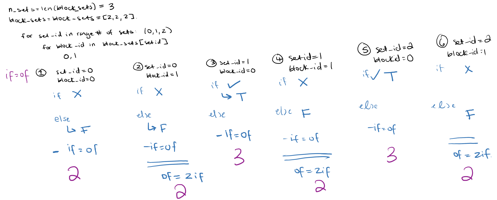

# Model

## Layer Summary 

| Layer # | Layer Name             | Input Size    | Output Size   | Kernal Info                      | Other                                               |
| ------- | ---------------------- | ------------- | ------------- | -------------------------------- | --------------------------------------------------- |
| 0       | Conv2D                 | (750, 31, 1)  | (750, 31, 16) | Shape: (3,3,1,16) Size: 93,3) |                                                     |
| 1       | Sequential             | (750, 31, 16) | (188, 10, 64) | \-                               | This is the sequential blocks with skip connections |
| 2       | BatchNormalization     | (188, 10, 64) | (188, 10, 64) | \-                               |                                                     |
| 3       | GlobalAveragePooling2D | (188, 10, 64) | (None, 64)    | \-                               |                                                     |
| 4       | Dense                  | (-1, 64)      | (None, 2)     | \-                               |                                                     |
| 5       | Softmax                | (None, 2)     | (None, 2)     | \-                               |                                                     |

You can access layers like this: 
def feature_extractor(pre_trained_model):
    extractor = tf.keras.models.Sequential(pre_trained_model.model.layers[0:6])
    extractor.trainable = False
    return extractor

## General Info
- Initial filters: 16
- Initial strides: 1
- Initial kernel: [3,3]
- Strides: 2
- Kernel: [3,3]
- No dropout (currently)
- Batch norm momentum: 0.99
- FScore loss
- train_X is a {16, 1500, 56, 1} array, which is batch size, time, freq, 1 (this was for two sec)
- one sec: {batch size, 750, 37, 1}
- train_Y is a {16,2} array (labels like [1. 0.], [0. 1.])

