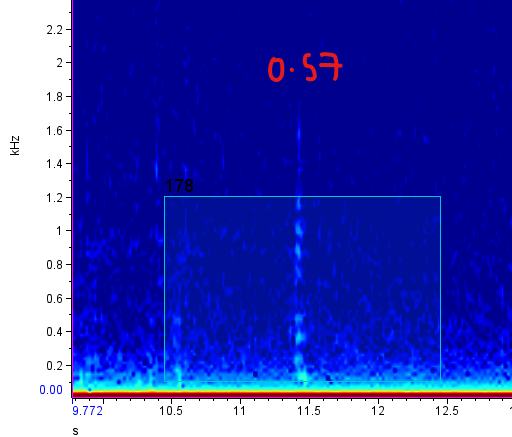
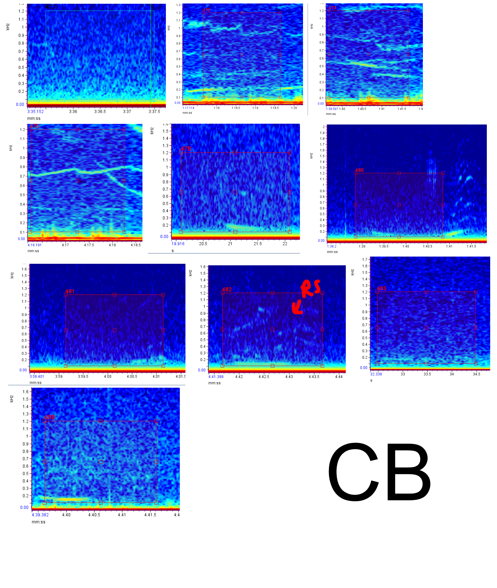
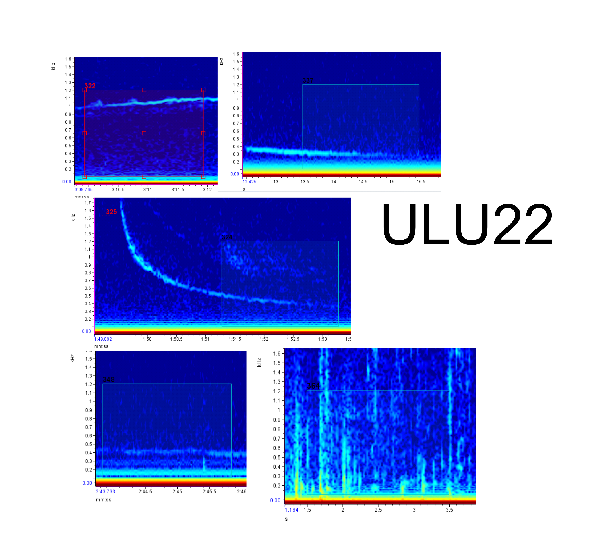

# Testing Results 

- True detections have low scores (none above 0.5)
- Lots of water noise and bearded seals in the false positives 
- Tried on Pierce Point and it doesn't work, will need to try fine-tuning with Fabios help 

## Images

### Correct Vid

### False Positives 

________________________________________________

________________________________________________

________________________________________________

________________________________________________

## Tables 

| False Positives |     |          |
| --------------- |-----| -------- |
| OU              | 14  | 1.682692 |
| O               | 6   | 0.721154 |
| OK              | 11  | 1.322115 |
| OB              | 14  | 1.682692 |

