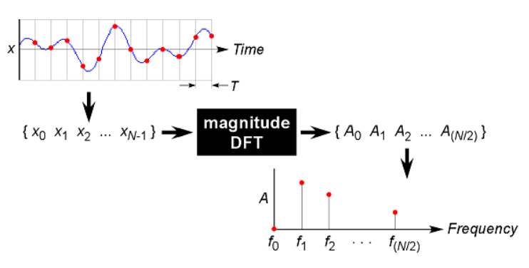

# Spectrograms 

## Spectrogram Basics 

- For an infinitely long sine-wave, there would be a frequency of 1/t (one peak in the spectrogram)
- Any sound can be represented as a combination of a series of pure tones 
- Talking about the magnitude spectrum (relative magnitude of each freq in entire signal) not phase spectrum
- DFT: discrete fourier transform: when the signal and spectrum are represented as a sequence of discrete digital values, a version of the FT called the DFT is used 
  - Input to DFT is a finite sequence of values (amplitude of the signal) sampled (digitized) at regular intervals
  - Output is sequence of balues specifying the amplitudes of a sequence of discrete freq components evenly spaced from 0 Hz to half the sampling frequency
  - Raven uses a FFT (fast fourier transform)

## Ketos:
- rate (ex. 3000): Desired sampling rate in Hz. If None, the original sampling rate will be used
- window (ex. 0.05): window length in seconds
- step (ex. 0.001): step size in seconds
- freq_min (ex. 100): lower frequency in Hz
- freq_max (ex. 1200): upper frequency in Hz
- window_func (ex. hamming): bartlett, blackman, hamming (default), or hanning
- type (ex. MagSpectrogram): MagSpectrogram, PowerSpectrogram, MelSpectrogram, or CQTSpectrogram
- duration (ex. 1.0): 
- resampling method (only relevant if rate is used): kaiser_best, kaiser_fast, scipy (default), polyphase
- normalize_wav: normalize to have mean of 0 and std of 1, default is false 
- smooth: width in seconds of the smoothing region for stitching together audio files 

## Raven: 
- window: hann
- size: # of samples (slider bar ex. 2466)
- time grid:
  - overlap
  - hop size (time grid resolution)
- frequency grid:
  - dft size (samples)
  - grid spacing (hz)

